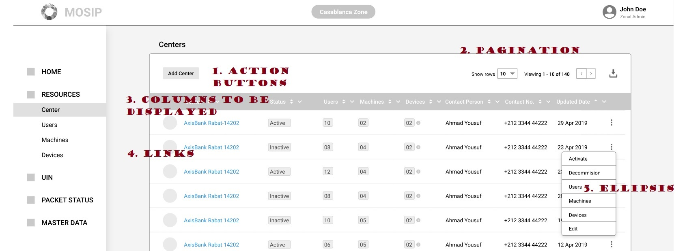

# Entity specifications

#### Background

There are entities in the Admin modules which shares the same layout and similar functionality. So when an entity page is loaded, the "Entity Spec" is called to get the details about the page from a configuration file. 


#### Solution


**The key solution considerations are**

- Following are the key considerations of the entity specification, 

	- The configurations are retrieved from the Angular code itself. 
	
	- This configurations are kept outside the Angular code only for the ease of development only. 
	
	- The entity page contains majorly 5 sections. 
		1. Action buttons
		2. Pagnination
		3. Columns to be displayed
		4. Links
		5. Ellipsis
	
	- Please refer to the following image for these sections, 


**Entity screen**




#### Sample entity specification:

```JSON
{  
	"actions":[  
		{  
			"buttonName":"string", 	
			"actionType":"redirect",
			"actionURL":"string",
			"redirectURL":"string",
			"show-in":"button",
			"onRowSelect":"string",
			"validationCallBackMethod":""
		}
	],
	"listColumns":[  
		{  
			"columnname":"string",
			"columnlabel":"string",
			"columnwidth":"string",
			"sortType":"ASC",				 
			"showAsLink":"boolean",
			"actionType":"redirect",
			"actionURL":"string",
		}
	],
	"viewColumns":[
		{  
			"viewfieldname":"string", 
			"viewfieldlabel":"string",
		}
	],
	"filterColumns":[
		{
			"filtername":"string",
			"filterlabel":"string",
			"uiField":"string",
			"filterType":"between",
		}
	]
}
```

#### Entity spec JSON field details
Name | Required | Description |  Example |
-----|----------|-------------|--------
actions |No|This is an array of actions the user can do on this entity.| |
buttonName | Yes | This is the text which is displayed on the button. This is retrieved from the language JSON file. 
actionType | Yes | This is the type of the action. It can be one of ['action','redirect'].| |
actionURL | Yes | This is mandatory if actionType is 'action'. This is the actionURL made by AJAX call and the response is displayed in that screen itself. Whatever mentioned inside the curly braces will be replaced by the JSON object value in the row which is selected | | https://mosip.io/admin/devices/id={deviceId} 
redirectURL | Yes | This is mandatory if the actionType is 'redirect'. This is the redirectURL for the actionType 'redirect'.  Whatever mentioned inside the curly braces will be replaced by the JSON object value in the row which is selected | | https://mosip.io/admin/devices/id={deviceId}
show-in | Yes | The value can be either of ['button','ellipsis','both'] | 'button' |
onRowSelect | No | This is the call back method once a row is seleted. For example, if the row selected contains status as 'Active' the button can be toggled to 'Deactivate' | | toggleActivateButton()
validationCallBackMethod | No | This is the call back method once the button is clicked. Validations can be pumped in here. | | doDeviceValidation()
listColumns | No | These are the columns displayed in the list screen. If this element is not there, all the returned fields from the service will be displayed.| |
columnname | Yes | This is the JSON object from which the value is retrieved and rendered in the screen. | |
columnlabel | No | This is the label of the column.  | Column name |
columnwidth | No | This is the width of the column. This is the colspan property | 1 |
sortType | No | This is the sort Type of the field displayed in table. It can one of ['ASC','DESC'] | No sorting is applied | DESC
showAsLink | No | Does this field should be displayed as link.| |
viewColumns | No | This is the array of fields which are displayed in the view screen | |
viewfieldname | No | This is the JSON variable name from the service URL | |
viewfieldlabel | No | This is the label for the field | |
filterColumns | No | This is the array of filters which are shown in the filter section | |
filtername | No | This is the field name which will be passed to the backend | |
filterlabel | No | This is the label for the field name | |
uiField | No | This can be one of ['dropdown','datepicker']| 'dropdown' |
filterType | No | This can be of of ['exact', 'between'].The UI developer will always put "From" and "To" fields as the label.  | 'exact' |
timeStamp |Yes|Date-time  in UTC ISO-8601| 2007-12-03T10:15:30Z


