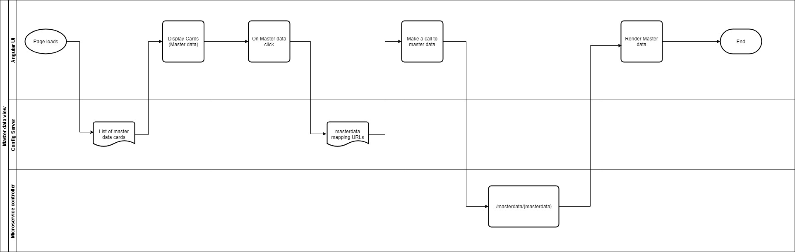

# Admin master data fetcher

#### Background

The admin should be able to adminster the master data from the Admin application. All the master data sets are rendered in the screen for the admin to select. Once selected, the master data view screen opens along with the filters<TODO: Requirements have to be further clarified>. There are more than 30 master data types are available. 

#### Solution

**The key solution considerations are**

- Following are the key considerations for the master data functionalities, 

1. The list of master data sets are configurable. The list is maintained in the config server. When the page is rendered, this list is retrieved and rendered.  

2. There is a single UI component which is used to render all the master data. When this component gets rendered, it recieves the master data name. 

3. The RESTful service URLs for the master data are configurable in the config server. This will be helpful in any service URL changes. 

4. The root URL or hostname should be defined separately and appended to the service URLs. This is helpful when we change from one environment to another. 

5. When a master data is selected, the service URLs are retrieved from the config server and the service call is made. 

6. There is a single RESTful controller which recieves the request for any master data. Based on the name, corresponding functionality is called the result is returned. 	

**Swimlane diagram**

