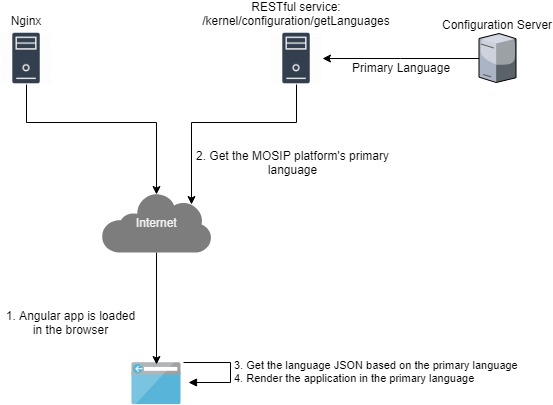

# Admin navigation

#### Background

The admin can access various functionalities available in the Admin application via the page navigation provided in the application. 

#### Solution

**The key solution considerations are**

- Following are the key considerations for the master data functionalities, 

1. The list of navigation items are directly coded in the Angular front end application itself. 

2. The navigations are achieved via the Angular routers. 

3. All the label's values are read from the i18 properties for the internationlization purpose. 
	- The angular application is served from the Nginx server. 
	- The angular application finds out the primary language from a service which inturn calls the Config server. 
	- Based on the primary language, the language JSON is chosen from the Angular application and worked upon. 

4. There can be 'n' levels of navigation items in the navigation functionality. 

5. During the formation of the URL, the URL conventions are followed.

6. Admin menus will be enabled / visible or disabled / hidden based on the role of the person logging in.

**Components**

