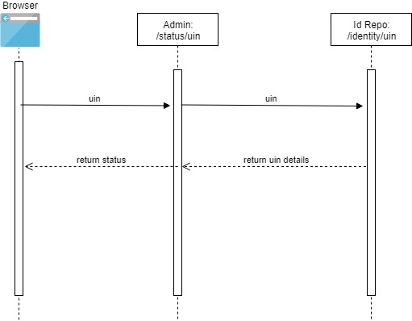

# Admin UIN Status

#### Background

Admin application is used by the adminstrators who configure the MOSIP platform. The administrators have access to check the status of the uin.
Admin module will be able to update the details of the uin.

#### Solution

Admin module allows the admin to check the status of the uin is valid or not.

1) Create an Interface which interacts with IDA identity services to get the details of the UIN.
2) Check for the status of the UIN Active or not Active.
3) Admin will be able to update the status of the UIN

**Sequence diagram**

## Implementation

**admin-uinservices** [README](../../../admin/admin-uinservices/README.md)

