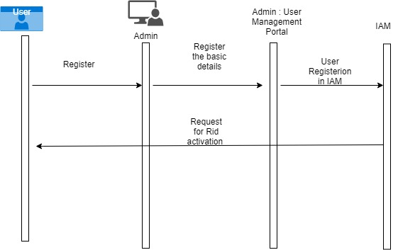

# Admin UserManagement

#### Background

Admin application is used by the adminstrators who configure the MOSIP platform. The administrators have access to register user , add new password
and update the details of the user.

#### Solution

Admin module allows the admin to check the status of the uin is valid or not.

1) Create an Interface which interacts with IAM to register user.
2) When user is created , an activation link to check the user is sent to validate the registered id.
3) User related password will be added based on the link provided by the admin.
4) Admin will have the provision to update the details of the user.

**Sequence diagram**

## Implementation

**admin-uinservices** [README](../../../admin/admin-usermgmt/README.md)

