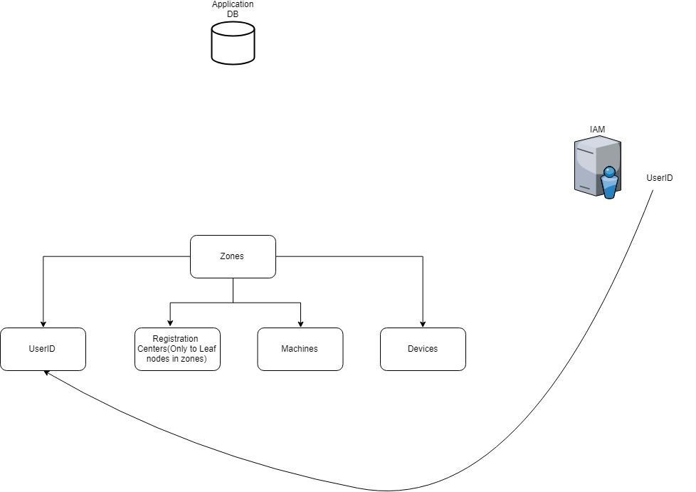
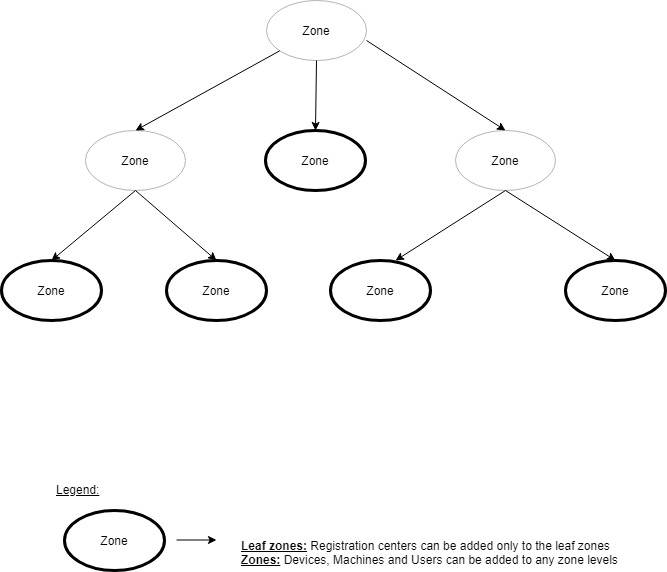

# Zones

#### Background

For administrative purpose, the Registration centers, Devices and Machines are mapped to the Zones. Each zone can have a specific administrator and only this administrator has the permissions to manage these devices.
The registration centers can be added only to the leaf nodes in the zonal hierarchy. The devices and machines can be added to any level in the zonal hierarcy. 

#### Solution

**The key solution considerations are**

- Following are the key considerations of the zonal concept, 

	- The lifecycle stages such as the CRUD operations of the zones are maintained in the Database.

	- The user actually exists in the Identity and Access Management(IAM) system. 

	- The user is linked to the zones and this relationship is maintained in the Database.
	
**User and Zone relationship diagram**

	
**Zones diagram**

	
	
- Let's say we are splitting a zone to multiple sub-zones. During this time, new sub-zones are created first and the entities are mapped to the newly created zones. Then the old zone is deleted. 

- When an API recieves the request, from the tokenID, the mapped zones are found out. From the zones value, the data is restricted in the business logic layer to return only the data, which the user is supposed to access. 