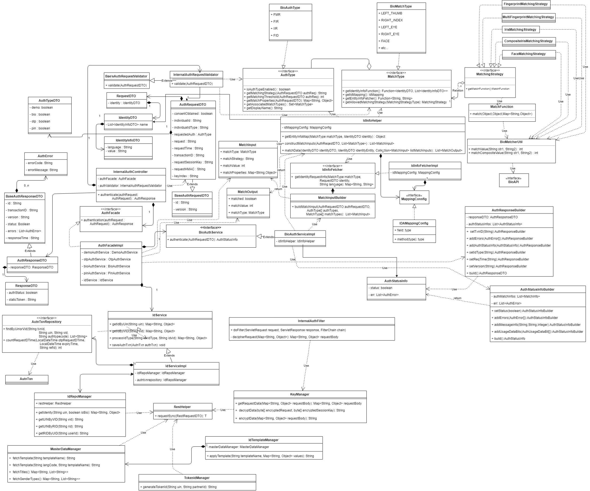
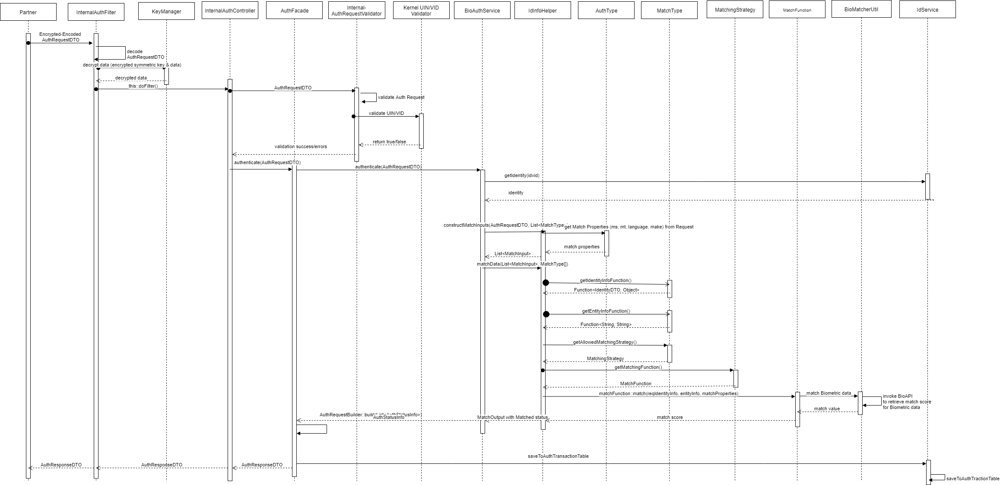

# Identity Auth Internal REST Service

**1. Background**

Identity Auth Internal REST service can be used to authenticate an Individual by MOSIP Products internally. It supports below types of authentications –
-	Pin based – OTP, Static Pin
-	Biometric based – Fingerprint, IRIS and Face

 ***1.1.Target Users -***  
MOSIP Products can use Identity Auth Internal REST service to authenticate an Individual by using one or more of the above types of authentication supported.

 ***1.2. Key Requirements -***   
-	MOSIP Products to authenticate an Individual using Identity Auth Internal REST service
-	MOSIP Products will send Individual's UIN/UserID to enable authentication of Individual
-	Identity Auth Internal REST service to check Individual's UIN/UserID for authenticity and validity
-	Spports only UIN, UserID as identity types in the Authentication request.

 ***1.3. Key Non-Functional Requirements -***   
-	Logging :
	-	Log each stage of authentication process
	-	Log all the exceptions along with error code and short error message
	-	As a security measure, Individual's UIN or PI/PA should not be logged
-	Audit :
	-	Audit all transaction details during authentication process in database
	-	Individual's UIN not be audited
	-	Audit any invalid UIN or UserID incidents
-	Exception :
	-	Any failure in authentication/authorization of Partner and validation of UIN and UserID needs to be handled with appropriate error code and message in Auth Response
	-	Any error in Individual authentication also should be handled with appropriate error code and message in Auth Response 
-	Security :
	-	Auth details of an individual is a sensitive information, hence should be encrypted before sending back the response
	-	Auth Request contains sensitive identity information of an Individual. This information should be encrypted by Partner before sending to IDA. On receiving this request, Partner should decrypt identity element before validating Individual's details for authentication purpose 

**2. Solution**   
Identity Auth Internal REST service addresses the above requirements as explained below.

1.	MOSIP Products to construct a **POST** request with below details and send to Request URL `/idauthentication/v1/identity/auth/internal` - [Sample Request Body](https://github.com/mosip/mosip/wiki/ID-Authentication-APIs#post-idauthenticationv1identityauthinternal)
2.	Validate 'requestTime' for incoming Auth Requests for valid format and timestamp < 30 minutes (configurable value) from current time
3.	Integrate with Kernel UIN Validator and VID Validator to check UIN/VID for validity. 
5.	Once the above validations are successful, Auth request is then validated based on biometric - Fingerprint/IRIS/Face - authentications present in input request. For these types of authentications, below are types of inputs supported –     
a.	Fingerprint – Image and Minutiae based    
b.	Iris – Image based    
c.	Face – Image based 
6.	Retrieve Identity details of the Individual based on UIN from ID Repository
7.	Respond with below success Auth response - [Sample Response](https://github.com/mosip/mosip/wiki/ID-Authentication-APIs#success-response-3)

**2.1. Class Diagram:**   
The below class diagram shows relationship between all the classes which are required for Bio authentication service.

**2.2. Sequence Diagram:**   

**3. Proxy Implementations -**   
Below are the proxy implementations used in ID-Authentication:
- ***MOSIP public key for encrypting Request block*** - The private key used for decrypting the request would be maintained in Partner Management Service, which is currently mocked using reference ID **INTERNAL** and application ID **IDA**, and public key of the same should be used while encrypting the request.
- ***keyIndex*** - No validation is performed for `keyIndex` which is present in the Authentication Request. This will be part of V2 implementation when Kernel Crypto would accept keyIndex based key validation.
- ***Biometric data*** - The biometric data such as Fingerprint/Iris/Face are stubbed.
- ***BioAPI Provider*** - The Biometric API provider used for matching the stubbed Fingerprint/Iris/Face data is mocked with stubbed BioAPI provider implementation.
- ***Device Specific Attributes*** - The Device Specific attributes in the Biometric Authentication request such as timestamp, transactionID, deviceCode,deviceProviderID, etc... are not validated. Only biometric attributes validated are bioType, bioSubType and bioValue.
- ***bioValue*** - The `bioValue` attribute in biometric data of the authentication request should be only base 64 encoded, and not encrypted.
- ***Digital Signature in request*** - Any digital signature added in the Auth request is not currently validated .
- ***Digital Signature in response*** - The Auth response is digitally signed using the MOSIP private key with reference ID **SIGN** and application ID **KERNEL**, and public key of the same should be used to verify the signature.
