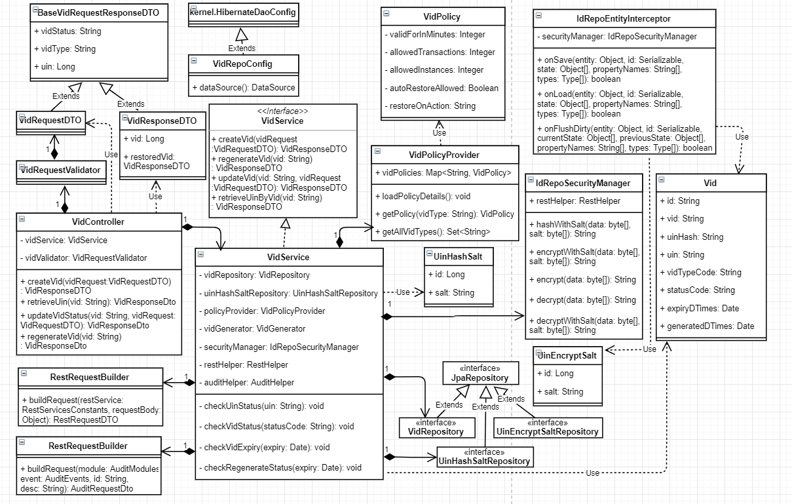
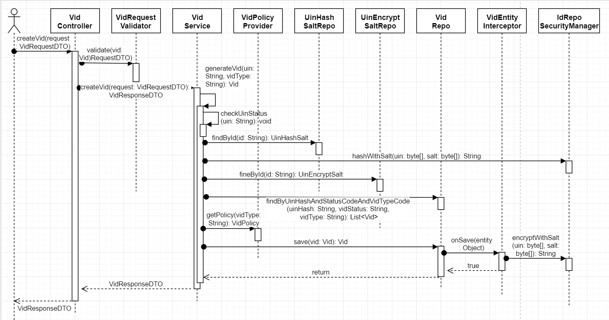
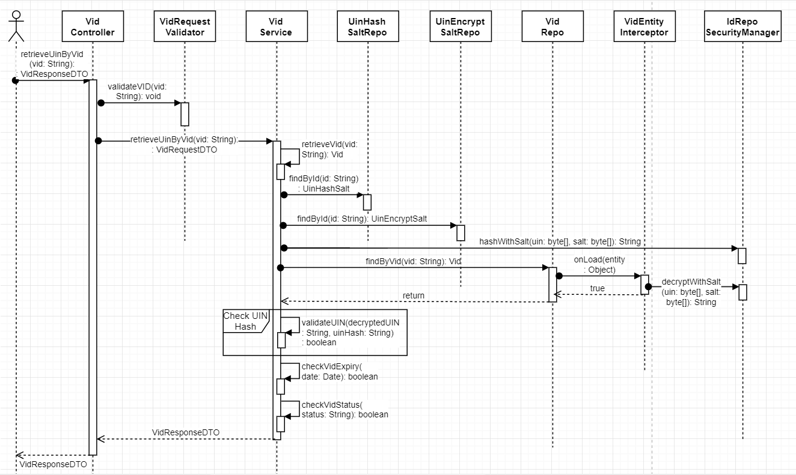
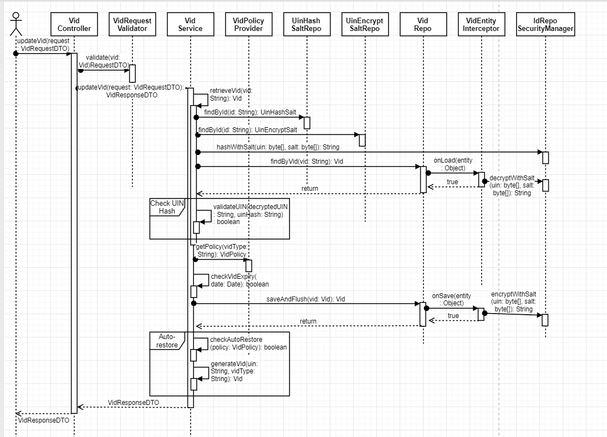

# Virtual Identity Service

## 1. Background       

Virtual Identity (VID) services can be used internally by modules to create VID based on VID Policy, retrieve UIN mapped to a VID and update VID attributes like VID status. 

***1.1.Target Users -***  
- Registration Processor can use VID services to create Perpetual VID associated with a UIN     
- Resident Services can use VID services to create Temporary VID, revoke or re-generate a VID     
- ID Authentication can use VID services to retrieve UIN associated with a VID    

***1.2. Key Functional Requirements -***   
-	Create and store VID mapped to an active UIN
-	Retrieve UIN for an active VID
-	Update VID status for an active VID

#### 1.2.1. Functional Flow Diagram - Create VID - 
      

#### 1.2.2. Functional Flow Diagram - Retrieve UIN By VID - 
 

#### 1.2.3. Functional Flow Diagram - Update VID Status - 
 

#### 1.2.4. Functional Flow Diagram - Re-generate VID - 
 

***1.3. Key Non-Functional Requirements -***   

-	Logging :
	-	Log all the exceptions along with error code and short error message
	-	As a security measure, Individual's UIN should not be logged
-	Audit :
	-	Audit all transaction details in database
	-	Individual's UIN should not be audited     
-	Exception :
	-	Any error in storing or retrieval or update of VID details should be handled with appropriate error code and message in the response  
-	Security :    
	-	Individual's UIN should not be visible, and should be encrypted in the database

### 2.	Solution    

The key solution considerations are   
- Create a project which provides REST service to create VID, update VID status and get UIN mapped to VID    
- REST service can be used by any MOSIP module to access these services through HTTP client         

**2.1.	Class Diagram**   
   

**2.2.	REST Services**   

***2.2.1.	Create VID***     

MOSIP Modules can use VID API spec available here - [Create VID API Spec](https://github.com/mosip/mosip/wiki/ID-Repository-API#create-vid) - to create Virtual Identity of an Individual, based on a given VID Policy.    

1. 	Receive UIN and VID Type as an input to generate a VID
2. 	Integrate with kernel-idvalidator-uin to validate incoming UIN
3.	Integrate with ID Repository Identity service to validate if input UIN is ACTIVE
4.	Retrieve hash_salt and encrypt_salt from ID Map DB for UIN ending with UIN modulo _UIN_divisor_ (configurable)
5.	Integrate with kernel-idgenerator-vid to generate VID string
6.	Encrypt and Hash UIN with the salts obtained in step4 in EntityInterceptor
7.	Create VID based in VID policy associated with input VID Type
8.	Save VID with input VID Type and status _ACTIVE_, mapped to input UIN

Below sequence diagram for create VID service shows the above sequence of operations in order to create VID and store in the database.   
   

***2.2.2.	Retrieve UIN for a given VID***   

MOSIP Modules can use VID API spec available here - [Update ID API Spec](https://github.com/mosip/mosip/wiki/ID-Repository-API#retrieve-uin-by-vid) - to retrieve Virtual Identity of a given UIN.   

1. 	Receive VID as input
2.	Check if VID status is _ACTIVE_
3.	Retrieve decrypted UIN from database in the EntityInterceptor 
4.	Integrate with ID Repository Identity service to validate if input UIN is _ACTIVE_
5.	Return UIN in the response

Below sequence diagram for retrieve UIN by VID service shows the above sequence of operations in order to retrieve UIN for VID from the database.   
   

***2.2.3.	Update VID Status***     

MOSIP Modules can use VID API spec available here - [Update VID Status API Spec](https://github.com/mosip/mosip/wiki/ID-Repository-API#patch-idrepositoryv1vidvid) - to update status of existing Virtual Identity of an Individual.    

1. 	Receive VID and status to be updated as an input
2. 	Integrate with kernel-idvalidator-vid to validate incoming VID
3.	Retrieve VID entity from database
4.	Check current VID status and expiry
5.	Update VID status and store in the database
6.	If VID status is REVOKED and input VID is of _Perpetual_ Type (i.e., auto-restoration is allowed), generate a new VID and store in the database with status _ACTIVE_

Below sequence diagram for update VID status service shows the above sequence of operations in order to update VID status and store in the database.   
   

***2.2.4.	Regenerate VID***   

MOSIP Modules can use VID API spec available here - [Update ID API Spec](https://github.com/mosip/mosip/wiki/ID-Repository-API#post-idrepositoryv1vidvidregenerate) - to regenerate Virtual Identity of a given UIN, with the same VID policy as existing VID.   

1. 	Receive VID as input
2. 	Integrate with kernel-idvalidator-vid to validate incoming VID
3.	Retrieve VID entity from database
4.	Integrate with ID Repository Identity service to validate if input UIN is _ACTIVE_
5.	If VID status is REVOKED and input VID is of _Temporal_ Type (i.e., auto-restoration is _NOT_ allowed), then set VID status as _INVALIDATED_ and update in the database
6.	Create a new VID with same VID Policy, mapped to same UIN and store in the database

Below sequence diagram for regenerate VID service shows the above sequence of operations in order to regenerate VID and store in the database.   
   
