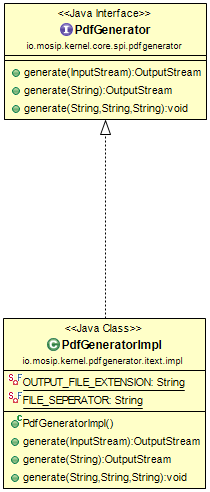

# PdfGenerator

#### Background

This Application can be use when converting plain/html template to PDF. This application contain a series of methods that accept template as:-

Input Stream
File
String

#### Solution

**The key solution considerations are**

- Create a project which generates pdf from provided template using pdf generator API.

- Create a interface PdfGenerator having required method declaration to generate pdf document.

- This pdf generator can be used in any MOSP Module to generate pdf after adding PdfGrenerate to their class path.

**The solution can be**

- Create a project which will have PdfGenerator implementation based on iText API.

- Create a wrapper interface in the Core SPI, which will be exposed to the caller.

- The jar file of the pdfgenerator-itext implementation has to be added in the class path of the caller.

**Class Diagram**

