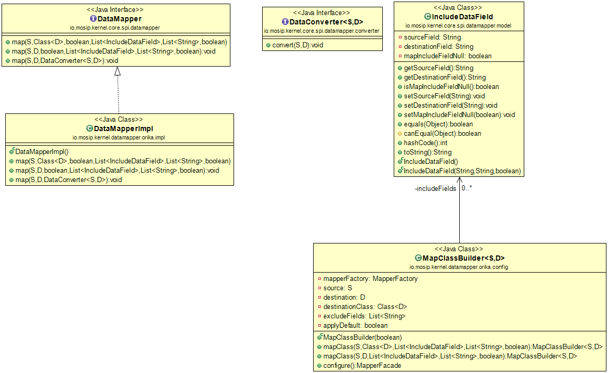

## Data Mapper

**Background**

This Application can be used to facilitate data mapping between objects.

This application contain a series of methods that accept following parameters:-

1.	Source Object
2.	Destination Object / Class
3.	Mapping Fields to include
4.	Fields to exclude
5.	Null mapping
6.	Default mapping
7.	Data converter

**Solution**

**The key solution considerations are**

-	Create a project in which a new instance of destination object mapped with the properties of source object is created.

-	Create the interface DataMapper having required method declaration to map object fields.

-	This data mapper can be used in any MOSIP Module to generate Entity/DTO object after adding DataMapper to their class path.

**The solution can be**

-	Create a project which will have Data Mapper implementation based on Orika API. 

-	Create a wrapper interface in the Core SPI, which will be exposed to the caller.

-	The jar file of the datamapper-orika implementation has to be added in the class path of the caller.

**Class diagram**

