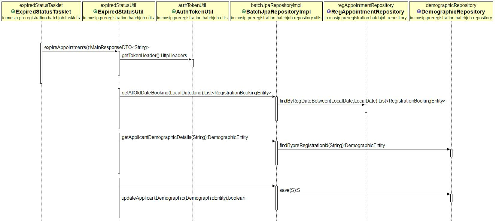
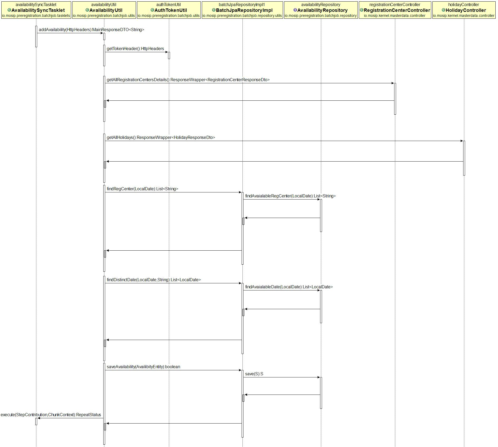

# Approach for Pre-Registration Batch Job

**Background**
- The Pre-Registration system should support Batch job for the following Activities.

	- Updating the status from **Booked** to **Expired**.
	- Updating the status to **Consumed** after Reverse Data sync.
	- Syncing Appointment Availability per Registration center from Master Data.

The target users are -
   - Pre-Registration system

**Class Diagram**

**Solution**

**Updating the status from Booked to Expired:**

1.	ExpiredStatus job has the expiredStatus step, which has expiredStatusTasklet.
2.	ExpiredStatusTasklet implement tasklet Interface and on completion give status like COMPETED, FAILED status in DB.
3.	ConsumedStatusTasklet calls ConsumedStatusUtil which first get auth token from AuthTokenUtil.
4.	Then it will take all preIds from reg_appointment table with appointment date between date before current date and last date on which expiredStatus job ran. And update the status to Expired in applicant_demographic.
7.	After completion availabilityUtil tasklet will update status in table, on success it will update COMPLETED in batch_job_execution table.
5.	If found error, it will ipdate FAILED status with exit code (which will be custom error code and message).

**Sequence Diagram**

**Updating the status to Consumed after Reverse Data sync:**

1.	ConsumedStatus job has the consumedStatus step, which has consumedStatusTasklet.
2.	ConsumedStatusTasklet implement task let Interface and on completion give status like COMPETED, FAILED status in DB.
3.	ConsumedStatusTasklet calls ConsumedStatusUtil which first get auth token from AuthTokenUtil.
4.	Then it will take all pre-registration id from processed_prereg_list table based on status comment (Processed by registration processor). It will get all consumed preIds and move all details from applicant_demographic, applicant_document & reg_appointment to applicant_demographic_consumed, applicant_document_consumed & reg_appointment_consumed respectively with consumed status. 
5.	 After completion availabilityUtil tasklet will update status in table, on success it will update COMPLETED in batch_job_execution table.
6.	If found error, it will update FAILED status with exit code (which will be custom error code and message).

**Sequence Diagram**

**Syncing appointment availability per Registration center from Master Data:**

1.	AvailabilitySync job has the availabilitySync step, which has availabilityTasklet.
2.	AvailabilityTasklet implement tasklet Interface and on completion give status like COMPETED, FAILED status in DB.
3.	 AvailabilityTasklet invokes AuthTokenUtil to get the auth token from kernel authmanager.
4.	With HttpHeaders containing token will pass this object to availabilityUtil.
5.	After completion availabilityUtil tasklet will update status in table, on success it will update COMPLETED in batch_job_execution table.
6.	If found error, it will update FAILED status with exit code (which will be custom error code and message).
7. The System will run a Batch Job at a certain dateTime from configuration  to syncing appointment availability per registration center.
8. Call the master data service to retrieve all the registration centers. In the response system will receive the Registration center Id, working hours, processing time, holiday code, number of kiosks. Insert into the **registartion_center_details** table.
9. Call the master data service for holiday details by providing the holiday code. system will receive all holiday date associated with that holiday code.
10. Calculate the time slots based on the processing time for the day and insert in the **registartion_center_time_slots** table.
11. link the **registartion_center_details** and **registartion_center_time_slots** tables with the registration center id.

**Sequence Diagram**

