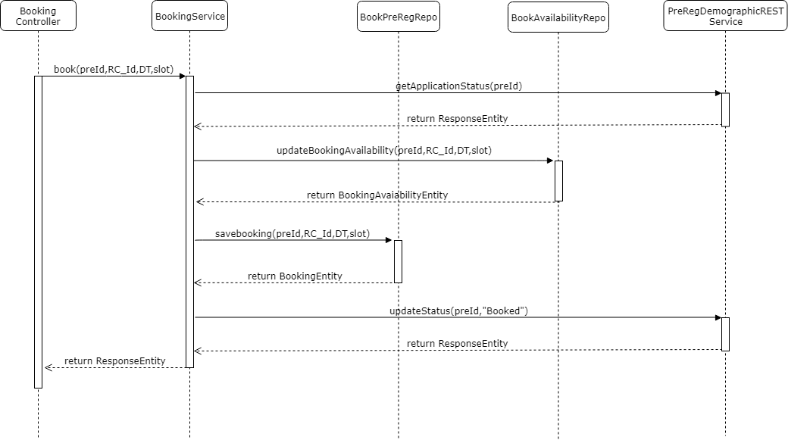

# Approach for Booking Registration center

**Background**
- Exposing the REST API to book a registration center with availability time slot for a citizen.

The target users are -
   - Pre-Registration portal

The key requirements are -

-   Create the API to book an appointment for the selectd Registration center and the availability time slot for the Registration center

-   Booking an appointment should have the detail of:

    -   Pre-Registration Id

    -   Registration center Id

    -   Registration Date

    -   From time slot

    -   To  time slot

- Only 'Pending-Appointment' pre-registartions are eligible for booking. if the pre-registration is in any other status other then 'Pending-Appointment' throw an exception saying 'Appointment booking can not be done'.

- Check for availability in the avialability table by using Registration center id, Registration date, from time slot and to time slot. 

- If there is an availability then update the availability  for requested time slot then store in a pre-registration booking table. 

- Once the booking data successfully stored then an status need to update in the applicant_demographic table to "Booked".

The key non-functional requirements are

-   Log the each state of the pre-registration creation:

    -   As a security measures the Pre-Id or applicant information should
        not be logged.

-   Audit :

    -   Each state of the Pre-Registration booking appointment should be stored into the DB for audit purpose.

    -   Pre-reg Id and important detail of the applicant should not be audited.

-   Exception :

    -   Any exception occurred during the registration booking, the same will
        be reported to the user with the user understandable exception.

**Solution**

**Booking an appointment :**

-  Create a REST API as '/booking' accept the PreRegistrationId,Registration center id, booking date, from time slot and to time slot from the pre-registration application portal.

- Check the status of the application by doing REST call. if the status is 'Pending-Appointment' then processed with booking appointment else throw an exception saying 'Appointment booking can not be done'.

-  Update the cache using the generated key by decrementing the value by 1. before updating check the number of availability.
      - If the number of availability is zero(0) then thow an exception saying Appointment booking can not be done.

-   Insert the booking data in the pre-registration booking table. after sucessfully inserting the data then update the main table (applicant_demographic) with the status code 'Booked'

- To update the main table (applicant_demographic) with the status code 'Booked' by doing REST call.

- If updation failed due to network issue then rollback the transaction and thow an exception 'Appointment booking failed'.

-   Audit the exception/start/exit of the each stages of the Pre-registration create mechanism using AuditManager component.

**Class Diagram**

**Sequence Diagram**

**Success / Error Code** 

 While processing the Registration center booking if there is any error or successfully then send the respective success or error code to the UI from API layer as  Response object.

  Code   |       Type  | Message|
-----|----------|-------------|
  PRG_PAM_RCI-001 |  Error   |   Appointment booking can not be done.
  PRG_PAM_RCI-002 |  Error   |   Availability not there for selected time slot.
  PRG_PAM_RCI-003 |  Error   |   User has not been selected any time slot.
  PRG_PAM_RCI_004  | Error   |   Appointment time slot is already booked.
  PRG_PAM_RCI_005  | Error   |   Appointment booking failed.

**Dependency Modules**

Component Name | Module Name | Description | 
-----|----------|-------------|
  Audit Manager     |   Kernel        |    To audit the process while creating the pre-registation.
  Exception Manager  |  Kernel     |       To prepare the user defined exception and render to the user.
  Log        |          Kernel         |   To log the process.
  Database Access   |    Kernel      |      To get the database connectivity

**User Story References**

  **User Story No.** |  **Reference Link** |
  -----|----------|
  **MOS-664**      |     <https://mosipid.atlassian.net/browse/MOS-664>
