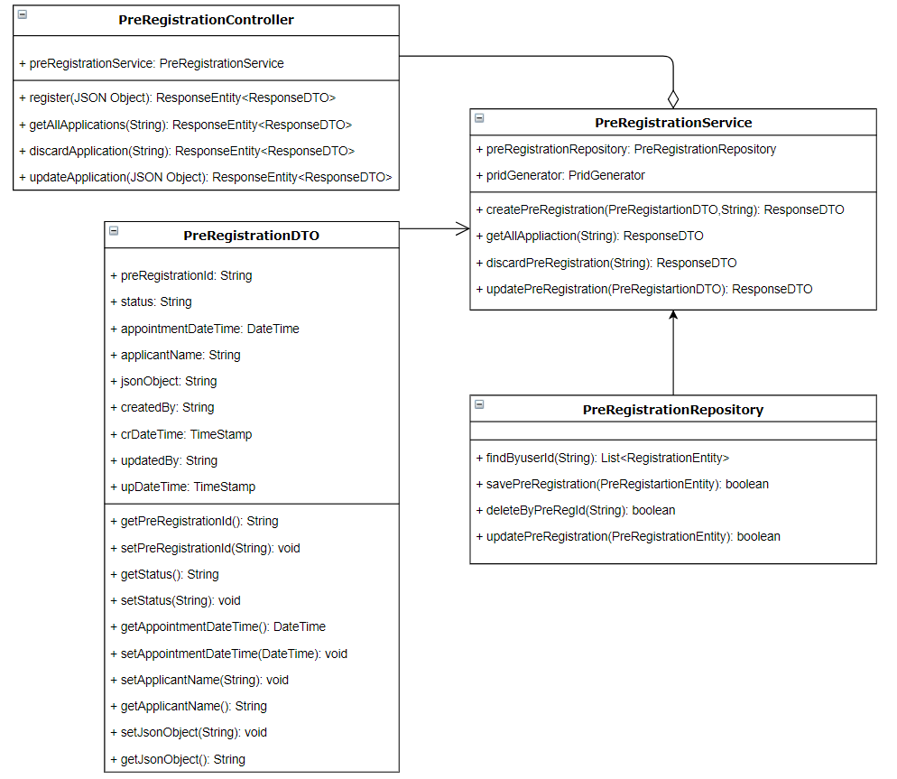

# Approach for Pre-Registartion demographic and document update

**Background**
-   Expose the API to update the demographic details and supporting document of the citizen for a pre-registration, where the data captured in the pre-registration portal should be update in database.

The target users are -
   - Pre-Registration portal user. 

The key requirements are -
-   Create the REST API to update the pre-registartion form and update document.

-   Demographic form should have the detail of:

    -   Name

    -   Age/DOB

    -   Gender Type

    -   Address

    -   Location details

    -   Contatct details

    -   CINE / PIN number.

- Document should have following type:
     - Proof of Identity

     - Proof of Address

     - Proof of DOB

- Once the demographic data is updated an REST API should get called and get updated in the database.

-  Only "Pending-Appointment" status pre-registation form should allow to update the demographic information and documents.

-  The API should return the success / failure status code along with
    the respective message.

- To update document, it should be a different microservice as per the technical architecture. 

- For each document update it should hit the rest api to delete the existing document in database and store the new document as per the document category.

- Integrating with Pre-Registartion UI client for pre-registration form(demoragphic and document).

The key non-functional requirements are

-   Security :

    -  The Pre-Registartion JSON form should be encrypt and stored in the     pre-registartion database.

-   Log the each state of the pre-registration creation:

    -   As a security measures the Pre-Id or applicant information should
        not be logged.

-   Audit :

    -   Each state of the Pre-Registration creation should be stored into the DB
        for audit purpose.

    -   Pre-reg Id and important detail of the applicant should not be audited.

-   Exception :

    -   Any exception occurred during the pre-registration, the same will
        be reported to the user with the user understandable exception.

Out of Scope

- Key management for encrypting JSON.

- Scanning the uploaded document for virus.

- Document quality checking to meet the threshold acceptence level.

- Encrypting the uploaded document and store it in database.

**Solution**
**Update existing pre-registration :**

-   Create a REST API as '/applications' accept the ID Definition JSON object (#id-definition-structure) from the pre-registration application portal.

- Once all the mandatory fields enter then only "Save" button get enable to call the REST API to create. 

-   Validate the request object against the ID Definition schema and render the respective error message.

-   If the provided request JSON object is valid then continue with the rest
    of the process.

-  To update process, due to performance criteria, get the existing per-registartion entity from database by pre-reg id and delete the entire row by pre-reg id and insert updated data with same pre-reg id.

-  Encrypte the requested JSON and store it in database with pre-registration id from the request object.

-   Audit the exception/start/exit of the each stages of the Pre-registration update mechanism using AuditManager component.

 **Update Document:**

-   Create a REST Service as '/documents' accept the JSON object (#document-json-structure) and a multipart file from the pre-registration application portal..

-   In the document JSON object it should contain the pre-registration id, document id, document type, document category, document format uploaded by and uploaded timestamp.

- 	Following operation need to be happen:

	Step1: Document Virus scanning, if successful go to next step otherwise throw an exception.{will be taken care in the integration user story}
	
	Step2: Document encryption, if successful go to next step otherwise throw an exception.{will be taken care in the integration user story}
	
	Step3: To update the document, get the existing document entity from database by pre-reg id and delete the entire row by pre-reg id and insert updated document with same pre-reg id and document id.

**Class Diagram**

**Sequence Diagram**

**Success / Error Code**
- While processing the Pre-Registration update if there is any error or successfully then send the respective success or error code to the UI from API layer as  Response object.

Code | Type | Message | 
-----|----------|-------------|
  0000      |             Success |   Packet Successfully created
  PRG_PAM_APP_001  |  Error   |   Unable create the pre-registration.
  PRG_PAM_APP_002  |  Error   |   Registration table not accessible
  PRG_PAM_APP_003  |  Error   |   Delete operation not allowed
  PRG_PAM_APP_004  |  Error   |   Failed to delete the registration
  PRG_PAM_APP_005  |  Error   |   Unable to fetch the registartions
  PRG_PAM_APP_006  |  Error   |   Failed to update the demographic data.
  PRG-PAM_APP_007  |  Error   |   Blacklisted Word entered.
  PRG_PAM_DOC_001 |  Error   |   Document failed to upload
  PRG_PAM_DOC_002 |  Error   |   Document exceeding premitted size
  PRG_PAM_DOC_003 |  Error   |   Document type not supported
  PRG_PAM_DOC_004 |  Error   |   Document invalid format
  PRG_PAM_DOC_005 |  Error   |   Document failed in virus scan
  PRG_PAM_DOC_006 |  Error   |   Document failed in quality check
  PRG_PAM_DOC_007 | Error    |   Document failed in encryption
  PRG_PAM_DOC_008 | Error    |   Document failed in decryption
  PRG_PAM_DOC_009 | Error    |   Document not present
  PRG_PAM_DOC_010 |  Error   |   Document failed to delete
  PRG_PAM_DOC_011 | Error    |   Document failed to copy
  PRG_PAM_DOC_012 | Error    |   Document failed to update

**Dependency Modules**

Component Name | Module Name | Description | 
-----|----------|-------------|
  Audit Manager     |   Kernel        |    To audit the process while creating the pre-registation.
  Exception Manager  |  Kernel     |       To prepare the user defined exception and render to the user.
  Log        |          Kernel         |   To log the process.
  JOSN Utility    |     Kernel       |     To validate the ID definition JSON object over ID Definition Schema
  Database Access   |    Kernel      |      To get the database connectivity

**User Story References**

  **User Story No.**|**Reference Link**
  -----|----------|
  **MOS-628**    |       <https://mosipid.atlassian.net/browse/MOS-628>
