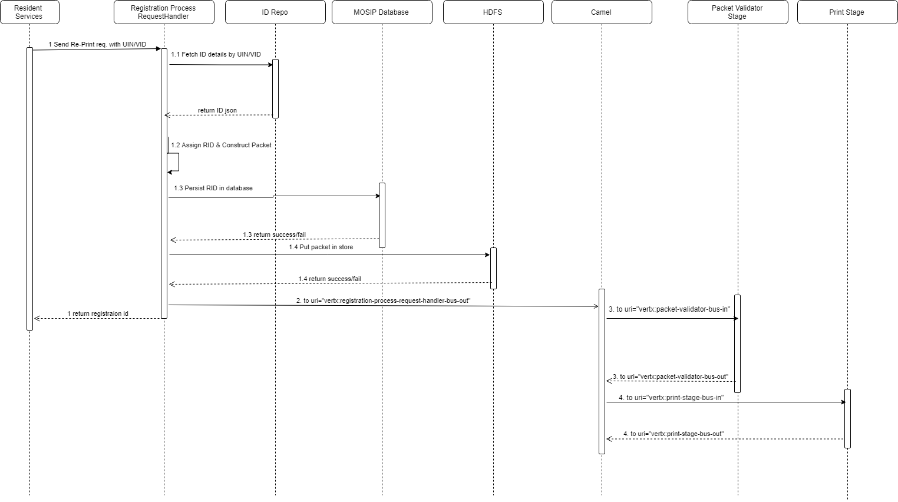

# Approach for Re-Print from External System

**Background**

A provision made in MOSIP for reprint request by UIN which will deliver physical UIN card to user on registered address.

The target users are -
Resident Services System

The key requirements are -
1. UIN for the Registration has been generated.
2. The ID Object has been sent to ID Repository post-UIN Generation.
3. UIN Card Template is present in Template Tables.


The key non-functional requirements are
1.	Auditing of the all the transactions including success and failed scenario:
2.	Logging of the all the requests
a.	INFO log message in case print request success or failed
b.	DEBUG log message in case if data fetched, PDF and text documents are created, PDF send on the queue.
c.	ERROR log message in case of any exception
3.	Exception handling
1. Security: Confidentiality and integrity of the message is maintained


**Solution**

The key solution considerations are -
1.	Create new stage "registration-processor-request-handler" 
```java
public class RegistrationProcessRequestHandler extends MosipVerticleAPIManager {
// Add code here.
}
```
1. Publish REST end point detail is as described [here](https://github.com/mosip/mosip/wiki/Registration-Processor-APIs#5-packet-generator-service "here") .
1. Validate requested data in RegistrationProcessRequestHandler and send validation error in case if validation fails. After successful validation generate registration id  and make entry in registration table
1. Construct packet by fetching details from ID repo [REST service](https://github.com/mosip/mosip/wiki/ID-Repository-API#get-idrepositoryv1identityuinuintypebio "REST service") by UIN and upload in HDFS.
1. Once packet successfully created and uploaded in HDFS send success response and in case of exception send error response.
1. Once packet uploaded successfuly send event "registration-process-request-handler-bus-out"
1. Create a camel flow "registration-processor-camel-route-reprint-secure-${ENV}.xml" with route to send event from one stage to another as below:
RegistrationProcessRequestHandler --> UinGeneratorStage --> PrintStage
	Update registration table with success or error in all stages.

**Sample Request and Response**
- Please refer to sample request response from the [API document](https://github.com/mosip/mosip/wiki/Registration-Processor-APIs#6-packet-generator-service "API document")
 
**Logical Architecture Diagram**

------------


**Sequence Diagram**

------------


