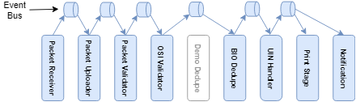

### Orchestration and Workflow
------------

MOSIP architecture fallows SEDA architecture pattern, which encourage to create stages which can be executed and deployed independently.
Registration processor is spilt into multiple fine-grained tasks which is executed by stages. In registration processor, orchestration is archived by composing all these stages together to achieve business objective, which is to create unique user identity.

Stages in MOSIP are designed not to communicate directly with each other. Communication between the stages is happen using event and event bus.
Orchestration in MOSIP is done with the help of event send over event bus.

This event based approach gives flexibility to create work flow by putting these stages together. Multiple workflow can be created based on the business need, which is executed independently. Advantage of this is code becomes more readable as developer understand process by looking at these workflows. 

##### MOSIP Stages: 
###### *Below is the list of reusable stages created in MOSIP*
------------

##### Lost UIN Flow:
###### *A workflow orchestrated using reusable stages to perform Lost UIN business activity.*
------------

##### Activate Deactivate UIN Flow:
###### *A workflow orchestrated using reusable stages to perform Activate Deactivate UIN.*
------------

