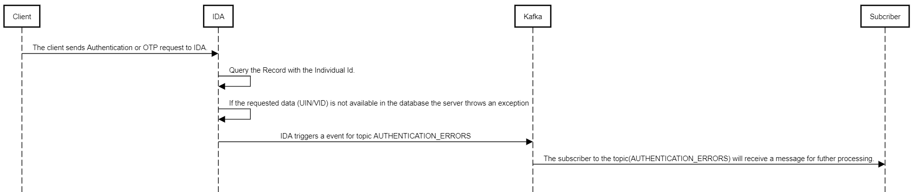

# Authentication Error Eventing Guide

## Overview
The resident has registered and obtain a valid UIN/VID and proceed with authentication by entering UIN/VID and get error as UIN is not available in database, then resident couldn’t proceed with authentication further as the provided UIN/VID is not available in IDA DB.
This could happen when a country has large number of registrations completed, processed and issued UINs.
Since resident is eager to authenticate, we want to prioritize the credential processing (along with template extraction) of this resident, we can tell him/her to retry and complete the authentication.
While getting the error UIN/VID is not available in database the kafka event is triggered which publish the data in to the topic and the subscriber will receive a message for futher processing.

## Configuration files
These properties needed to be modified to configure this feature
id-authentication-default.properties: 

- It enable and disable the bean init of kafka and Authentication error eventing
```
mosip.ida.authentication.error.eventing.enabled=true
```

- If we enable authentication error eventing as true we need all the below property
```
ida-topic-authentication-error-eventing=AUTHENTICATION_ERRORS
```

- Partner Id for encryption used in ondemand template extraction
```
mosip.ida.authentication.error.eventing.encrypt.partner.id=mpartner-default-tempextraction
```

- kafka Configuration
```
mosip.ida.kafka.bootstrap.servers=kafka-0.kafka-headless.${kafka.profile}:${kafka.port},kafka-1.kafka-headless.${kafka.profile}:${kafka.port},kafka-2.kafka-headless.${kafka.profile}:${kafka.port}
spring.kafka.admin.properties.allow.auto.create.topics=true

```

## Image source



## Steps of sequence diagram:
```
1. Client -> IDA : The client sends Authentication or OTP request to IDA.
2. IDA ->IDA: Query the Record with the Individual Id.
3. IDA ->IDA :If the requested data (UIN/VID) is not available in the database the server throws an exception
4. IDA-> Kafka:IDA triggers a event for topic AUTHENTICATION_ERRORS
5. Kafka->Subscriber : The subscriber to the topic(AUTHENTICATION_ERRORS) will receive a message for futher processing.

```
## Event Structure published to kafka:
```
{
	"publisher": "IDA",
	"topic": "AUTHENTICATION_ERRORS",
	"publishedOn": "2024-01-03T09:45:13.992Z", (Current date and time)
	"event": {
		"id": "<unique auto generated id> ",
		"data": {
			"error_Code" : "IDA-MLC-018"
			"error_message" : "UIN not available in database"
			"requestdatetime": "yyyy-mm-ddThh:mm:ss", (Current date and time)
			"individualId" :"<value of UIN/VID> (This should be encrypted with a public key)"
			"authPartnerId" :"<value of partner id>" 
			"individualIdType": "UIN",
			"entityName": "<value of partner name>",
			"requestSignature": ""
		}
	}
}
```
