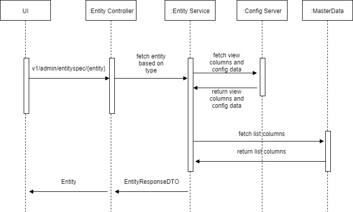

# Entity UI

**Background**
- This service can be used to fetch the entity specification to be loaded in the page.This service will include the 
actions , filter columns, display and actioncolumns.

**Solution**

  - Create a Rest Controller with Request URL "v1/admin/entityspec/{entity}".
  - Create a Rest Service which fetches the data to be diplayed for the following entities,
     
        Actions : 
            Specifies the actions to be shown on displayed buttons or pop-up.Actions has attributes
            like name,type,redirecturl,actionurl, show as button or popup,onRowselect and validation.
        ListColumns :
            Specifies the columns to be displayed on the UI to have an action specified to it.This has attributes
            like columnname,columnlabel, width,show as link, action url and type.
        ViewColumns :
            Specifies the columns to be used for viewing purpose, has no action to it.This has attributes
            like view field, and view name.
        FilterColumns :
            Specifices the columns to be used for filter data. This has attributes like filter name , filter label,
            ui field such as drop down or date picker and filter type.
            
  - Admin UI component can fetch the entites to be displayed for the tables.

**Sequence Diagram**

        