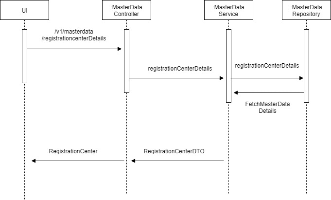

# RegistrationCenter

**Background**
- This service can be used to perfom CRUD operations on registrationcenter.

**Solution**

   - Create a Rest Controller with Request URL "v1/masterdata/registrationcenter".
   - Create a Rest Service which performs CRUD operation on registration center.                 
   - Admin UI component can fetch the entites to be displayed for the tables.

**Sequence Diagram**

        