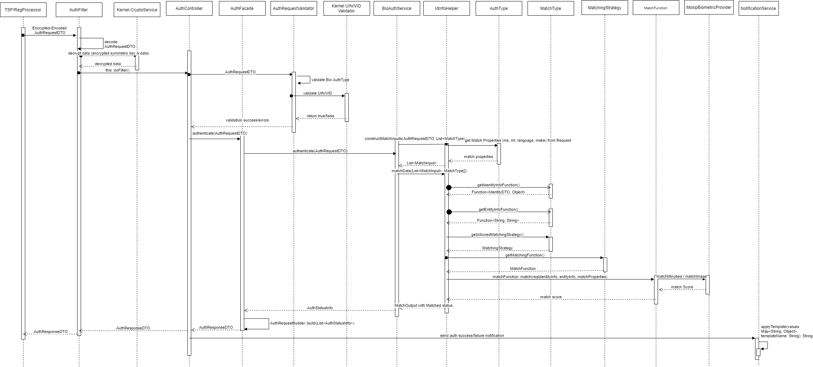

# Biometric Auth REST Service

**1. Background**

Biometric Auth REST service can be used to authenticate an Individual using below types of Biometrics - 
1.	Fingerprint 
2.	Iris
3.	Face

***1.1.Target users -***  
Partner can use Auth service to authenticate an Individual by using one or more types of authentication supported by MOSIP and retrieve Auth details as a response.

 ***1.2. Key requirements -***   
-	Partner can authenticate an Individual using one or more authentication types
-	Partner will send Individual's UIN/VID to enable authentication of Individual
-	Partner will send Partner ID and MISP License Key to authenticate and authorize a Partner to authenticate an Individual
-	Check Individual's UIN/VID for authenticity and validity
-	Validate biometric details of the Individual against the one stored in database
-	Inform authentication status (success/failure) to the Individual in the form of message and/or email

***1.3. Key non-functional requirements -***   
-	Log :
	-	Log each stage of authentication process
	-	Log all the exceptions along with error code and short error message
	-	As a security measure, Individual's UIN or PI/PA should not be logged
-	Audit :
	-	Audit all transaction details during authentication process in database
	-	Individual's UIN should not be audited
	-	Audit any invalid UIN or VID incidents
-	Exception :
	-	Any failure in authentication/authorization of Partner and validation of UIN and VID needs to be handled with appropriate error code and message in Auth response
	-	Any error in Individual authentication also should be handled with appropriate error code and message in Auth Response 
-	Security
	-	Auth details of an individual is a sensitive information, hence should be encrypted before sending to Partner
	-	Auth Request contains sensitive identity information of an Individual. This information should be encrypted by Partner before sending to IDA. On receiving this request, Partner should decrypt identity element before validating Individual's details for authentication purpose 

**2. Solution**   
1.	Partner needs to construct a POST request with below details and send to Request URL `/idauthentication/v1/identity/auth/` - [Sample Request](https://github.com/mosip/mosip/wiki/ID-Authentication-APIs#post-idauthenticationv1identityauth)
2.	Authenticate and Authorize Partner and MISP using their Policy and LicenseKey respectively
3.	Validate 'requestTime' for incoming Auth Requests for valid format and timestamp < 30 minutes (configurable value) from current time
4.	Integrate with Kernel UIN Validator and VID Validator to check UIN/VID for validity. 
5.	Once the above validations are successful, Auth request is then validated based on biometric - Fingerprint/IRIS/Face - authentications present in input request. For these types of authentications, below are types of inputs supported –     
a.	Fingerprint – Image and Minutiae based    
b.	Iris – Image based    
c.	Face – Image based    
6.	Retrieve Identity details of the Individual based on UIN from ID Repository
7.	Retrieve mode of communication with Individual using admin config to send authentication success/failure information
8.	When the Individual is successfully authenticated based on one or more of the above authentication types, a sms/email notification is sent to them using Kernel's SmsNotifier and EmailNotifier to their stored phone/email respectively.
9.	Respond to Partner with below success Auth response - [Sample Response](https://github.com/mosip/mosip/wiki/ID-Authentication-APIs#success-response)

**2.1. Class Diagram:**   
The below class diagram shows relationship between all the classes which are required for Bio authentication service.

**2.2. Sequence Diagram:**   

**3. Proxy Implementations -**   
Below are the proxy implementations used in ID-Authentication:
- ***MISP verification*** - Mocked the verification of MISP based on the using mocked *License Key*.
- ***Partner verification*** - Mocked the verification of Partner based on Mocked *Policy* for the partner which provides the information on whether the Biometric Authentication request is allowed.
- ***MOSIP public key for encrypting Request block*** - The public key used for decrypting the request would be published in Partner Management Service, which is currently mocked using referenceID **"PARTNER"**, and the same should be used while encrypting the request.
- ***keyIndex*** - No validation has been added for keyIndex which is present in the Authentication Request. This will be part of V2 implementation when Kernel Crypto would accept keyIndex based key validation.
- ***Digital Signature*** - Any digital signature added in the Authentication request is currently not validated.
- ***Biometric data*** - The biometric data such as Fingerprint/Iris/Face are stubbed.
- ***BioAPI Provider*** - The Biometric API provider used for matching the stubbed Fingerprint/Iris/Face data is mocked with stubbed BioAPI provider implementation.
- ***Device Specific Attributes*** - The Device Specific attributes in the Biometric Authentication request such as timestamp, transactionID, deviceCode,deviceProviderID, etc... are not validated. Only biometric attributes validated are bioType, bioSubType and bioValue.
- ***BioValue*** is only encrypted, not encoded&lt;&lt;TBD&gt;&gt;