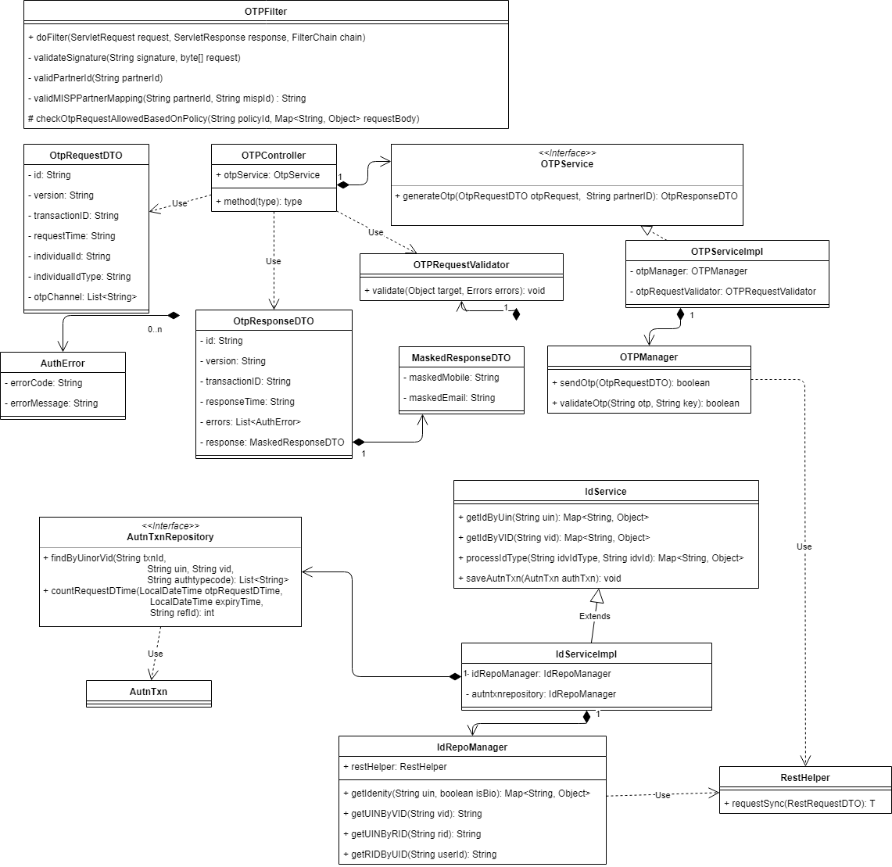
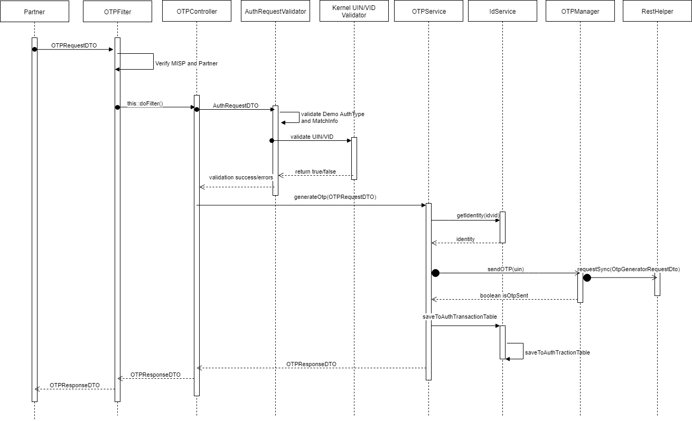

# OTP Request REST Service

**1. Background**

MOSIP Partner can request an OTP for an individual, which can be used to perform OTP based authentication using OTP Request API for that Individual.

 ***1.1.Target users -***  
MOSIP Partner will request for an OTP on behalf of an Individual

 ***1.2. Key requirements -***   
-	MOSIP Partner can authenticate an Individual using OTP sent to the Individual by OTP Request API
-	MOSIP Partner will capture Individual’s UIN/VID and construct OTP Request
-	Once OTP Request is received, authenticate and authorize Partner
-	Check Individual’s UIN/VID for authenticity and validity
-	Create and send OTP to the Individual via message and/or email

 ***1.3. Key non-functional requirements -***   
-	Logging :
	-	Log each stage of OTP Request processing
	-	Log all the exceptions along with error code and short error message
	-	As a security measure, Individual’s UIN or PI/PA should not be logged
-	Audit :
	-	Audit all transaction details in database during OTP Request processing
	-	Individual’s UIN or PI/PA details should not be audited
	-	Audit any invalid UIN or VID incidents
-	Exception :
	-	Any failure in authentication/authorization of Partner and validation of UIN and VID needs to be handled with appropriate error code and message in KYC’s auth response
	-	Any error in Individual authentication also should be handled with appropriate error code and message in Kyc Auth Response 

**2. Solution**   
OTP Request REST service addresses the above requirement -  

1.	MOSIP Partner to construct a POST request with below details and send to Request URL 
`/idauthentication/v1/otp/` - [Sample Request Body](https://github.com/mosip/mosip/wiki/ID-Authentication-APIs#post-idauthenticationv1otp)
2.	Authenticate and Authorize MOSIP Partner.
3.	Validate “reqTime” for incoming OTP Requests for valid format and timestamp < 20mins from current time
4.	Integrate with kernel UIN Validator and VID Validator to check UIN/VID for validity. Validate UIN/VID for authenticity in AuthDB
5.	Create OTP using OTP key in the format using OtpUtil- <product_id>_<uin_ref_id>_<txn_id>_<mua_code>
6.	Retrieve mode of communication with Individual using admin config to send generated OTP
7.	Integrate with Kernel SmsNotifier and EmailNotifier to send the generated OTP to their stored phone/email respectively.
8.	Respond to MOSIP Partner with success Auth response - [Sample Response](https://github.com/mosip/mosip/wiki/ID-Authentication-APIs#success-response-2)

**2.1. Class Diagram**

Below are details on the above classes –
-	***OTPRequestDTO*** – Request object with input request for OTP
-	***OTPResponseDTO*** – Response object with success or failure to generate and send OTP
-	***IDAuthFilter*** – Spring filter to intercept OTP Request and Response in order to authenticate/authorize Partner
-	***OTPController*** – Spring Controller to receive OTP Request
-	***OTPRequestValidator*** – Spring Validator to validate input request object OTPRequestDTO
-	***OTPService*** – Spring Service that interacts with OTPManager and OTPUtil to generate OTP
-	***OTPManager*** – Manager class to integrate with Kernel Generate OTP and Validate OTP Rest APIs
-	***OTPUtil*** – Utility class to generate unique key to be used to generate OTP
-	***IDAuthControllerAdvice*** – Spring Controller Advice used to handle all exceptions and send corresponding error response
-	***IDAuthService*** –Spring Service that validates UIN and VID for its authenticity
-	***NotificationService*** – Sprint Service used to send generated OTP to individual as SMS and/or Email
-	***RestHelper*** – Helper class used to make REST API calls

**2.2. Sequence Diagram -**

**3. Proxy Implementations -**   
Below are the proxy implementations used in ID-Authentication:
- ***MISP verification*** - Mocked the verification of MISP based on the using mocked *License Key*.
- ***Partner verification*** - Mocked the verification of Partner based on Mocked *Policy* for the partner which provides the information on whether the OTP request is allowed.

