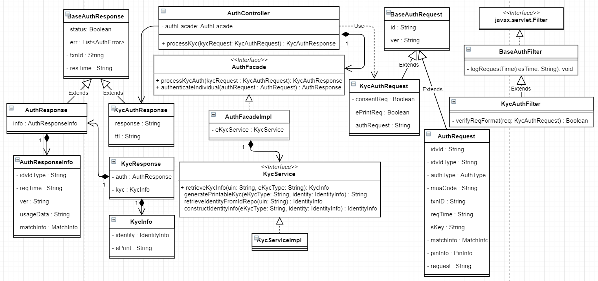

# eKYC Auth REST Service

**1. Background**

eKYC Auth REST service can be used to authenticate an Individual and respond back with KYC details along with Authentication details. 

 ***1.1.Target users -***  
Partner can use eKYC service to authenticate an Individual by using one or more types of authentication supported by MOSIP and retrieve KYC details of Individual along with Authentication details.

 ***1.2. Key requirements -***   
-	Partner can authenticate an Individual using one or more authentication types
-	Partner will send Individual’s UIN/VID to enable authentication of Individual
-	Partner will send Partner ID and MISP License Key to authenticate and authorize a Partner to authenticate an Individual
-	Partner sends Individual’s consent as part of KYC request
-	Check Individual’s UIN/VID for authenticity and validity
-	Validate if Individual’s consent is provided to access KYC details
-	Validate authentication details against the one stored in database
-	Inform authentication status (success/failure) to the Individual in the form of message and/or email

 ***1.3. Key non-functional requirements -***   
-	Logging :
	-	Log each stage of authentication process
	-	Log all the exceptions along with error code and short error message
	-	As a security measure, Individual’s UIN should not be logged
-	Audit :
	-	Audit all transaction details during authentication process in database
	-	Individual’s UIN or PI/PA details should not be audited
	-	Audit any invalid UIN or VID incidents
-	Exception :
	-	Any failure in KYC permissions of Partner or consent needs to be handled with appropriate error code and message in KYC Response
	-	Any failure in authentication/authorization of Partner and validation of UIN and VID needs to be handled with appropriate error code and message in KYC’s auth response
	-	Any error in Individual authentication also should be handled with appropriate error code and message in Kyc Auth Response 
-	Security :
	- 	KYC details of an individual is a sensitive information, hence should be encrypted before sending to Partner
	-	Kyc Auth Request contains sensitive identity information of an Individual. This information should be encrypted by Partner before sending to IDA. On receiving this request, Partner should decrypt identity element before validating Individual’s details for authentication purpose. 

**2. Pre-requisites**   
Below admin configurations should be available before implementing the solution.
-	eKYC REST service supports only certain authentication types which are allowed in the country specific configuration among the authentications supported by Identity Authenticatoin Service.
-	The KYC details returned to the partner are limited to the attributes allowed to the partner in the policy associated to a Partner while Partner Registration in Partner Management Service

**3. Solution**   
KYC Auth REST service addresses the above requirements as explained below.

1.	Partner needs to construct a POST request with below details and send to Request URL `/idauthentication/v1/identity/kyc/` - [Sample Request Body](https://github.com/mosip/mosip/wiki/ID-Authentication-APIs#post-idauthenticationv1identitykyc)
2.	Authenticate and Authorize Partner and MISP using their Policy and LicenseKey respectively
3.	Validate 'requestTime' for incoming Auth Requests for valid format and timestamp < 30 minutes (configurable value) from current time
4. Integrate with kernel UIN Validator and VID Validator to check UIN/VID for validity. Validate UIN/VID for authenticity in AuthDB
5. Once the above validations are successful, Kyc Auth Request is then validated based on specific authentication types (which are allowed in the country specific configuration) as described below.
	a.	OTP Auth – OTP value sent to the Individuals are validated
	b.	Demo Auth – Input Demo fields are validated against stored Individual’s Demo Fields
	c.	Pin Auth – Static Pin generated by the Individuals is validated against the input pin
	d.	Bio Auth – Fingerprint/IRIS/Face minutiae stored is validated against input bio minutiae
7. 	Upon successful authentication, retrive the KYC details from ID Repository, filter the fields based on the allowed attributes in the Policy.
8.	Retrieve mode of communication with Individual using admin config to send authentication success/failure information
9.	When the Individual is successfully authenticated based on one or more of the above authentication types, a sms/email notification is sent to them using Kernel’s SmsNotifier and EmailNotifier to their stored phone/email respectively.
10.	Respond to Partner with below success KYC Auth response - [Sample Response](https://github.com/mosip/mosip/wiki/ID-Authentication-APIs#success-response-1)

**3.1. Class Diagram:**   
The below class diagram shows relationship between all the classes which are required for KYC authentication service.

**2.4. Sequence Diagram:**   

**3. Proxy Implementations -**   
Below are the proxy implementations used in ID-Authentication:
- ***MISP verification*** - Mocked the verification of MISP based on the using mocked *License Key*.
- ***Partner verification*** - Mocked the verification of Partner based on Mocked *Policy* for the partner which provides the information on whether the KYC Auth request is allowed.
- ***MOSIP public key for encrypting Request block*** - The public key used for decrypting the request would be published in Partner Management Service, which is currently mocked using referenceID **"PARTNER"**, and the same should be used while encrypting the request.
- ***keyIndex*** - No validation has been added for keyIndex which is present in the Authentication Request. This will be part of V2 implementation when Kernel Crypto would accept keyIndex based key validation.
- ***Digital Signature*** - Any digital signature added in the Authentication request is currently not validated.
- ***Encrypted KYC response*** - KYC Response is encrypted using mocked MOSIP public key using referenceID **"PARTNER"**, and the same should be used to decrypt the response.
- ***secondaryLangCode***&lt;&lt;TBD&gt;&gt;
- ***BioValue*** is only encrypted, not encoded&lt;&lt;TBD&gt;&gt;
