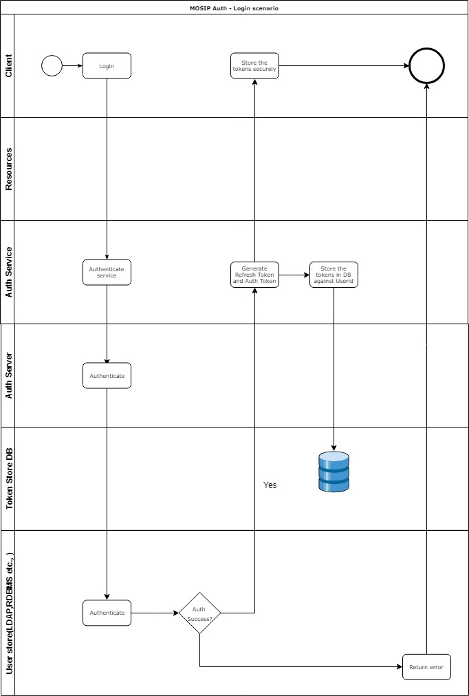
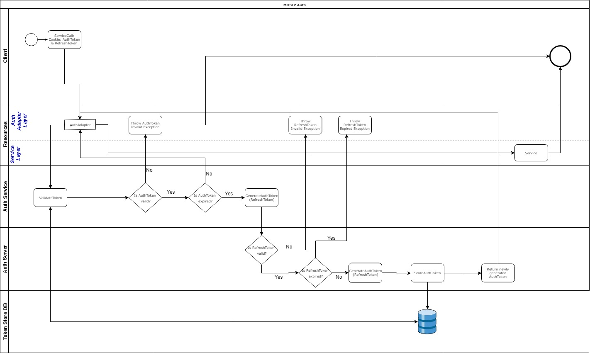
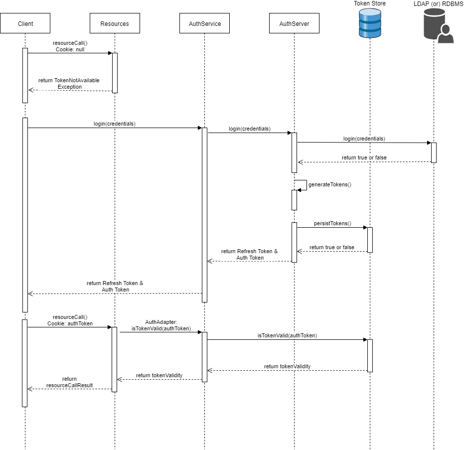

# Authentication and Authorization in MOSIP platform

#### Background

The authentication and authorization in the MOSIP platform is handled in the a centralized place. OAuth 2.0 authorization framework is used as the standards.JSON Web Token(JWT) is used as a mechanism to implement OAuth2.0 framework. 

#### Solution

**The key solution considerations are**

- A centralized Auth Server handles the authorization request from the platform. 

- Once authenticated, the Auth Server  sends back a Token. There are 2 types of Tokens are used in the MOSIP platform. Once is Access token and the other is the Refresh token. 

- Access token contains the information about the authenticated user and the meta data such as the expiration time, subject, issuer etc., 

- Refresh token is long lived. The refresh token is used to get a new Access token. 

- An additional layers in the Auth service will ensure about the forced logout scenario. Essentially, all the service calls to the Auth Service will go through this creamy layer, where we have a proxy user datastore which will maintain the additional information about the validitiy of the tokens. 

- The Tokens are stored in the creamy layer for an individual user. In case of force logout scenario, this record will be deleted from this proxy user datastore. 

**Class diagram**

**Login - Swimlane diagram**

**Service call - Swimlane diagram**

**Sequence diagram**

## Implementation

**kernel-auth** [README](../../kernel/kernel-auth/README.md)
