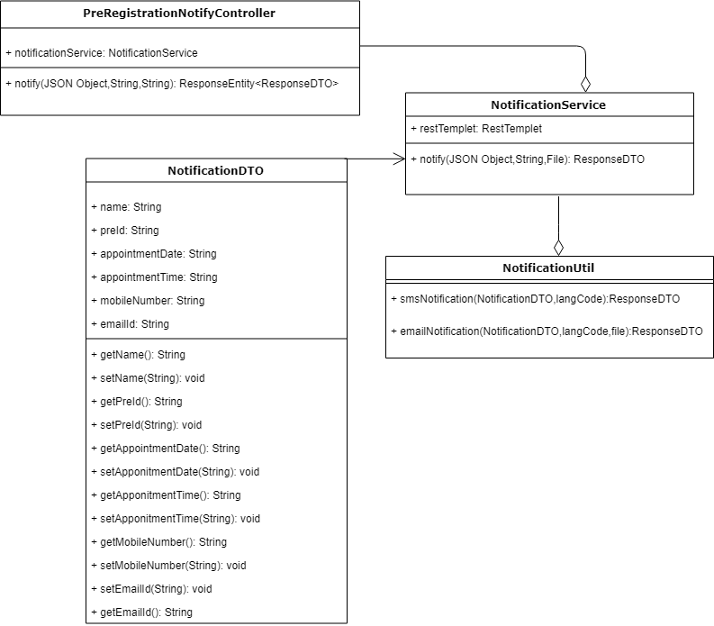
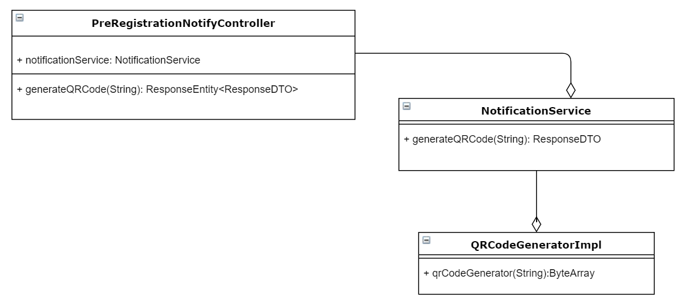
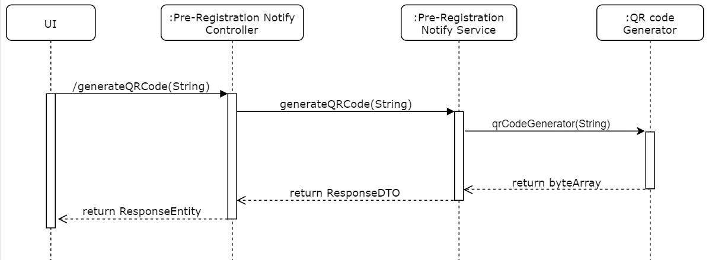
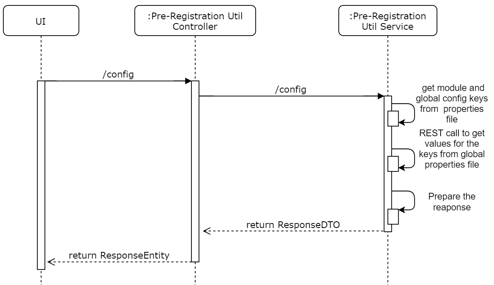

# Approach for Notification Service

**Background**
- Exposing the REST API to notify via SMS or email to a citizen.

The target users are -
   - Pre-Registration UI

The key requirements -

-   Create the REST API to notify via SMS or email to a citizen while sending any notification. which internally call the kernel notification service.

The key non-functional requirements are

-   Log the each state while sending notification to a citizen:

-   Exception :
    -   Any exception occurred during sending notification, the same will
        be reported to the user with the user understandable exception.

**Solution**

**Notify :**

- Create a REST API as '/notify' accept the notification details, lang code, document for attachment from the pre-registration application portal to send the notification via SMS or email. This service internally calls kernel notifiaction utility.

- notification details contains name, pre-registration id, appointment date, appointment time, mobile number, email address

- lang code is to get the corresponding language notification templet .

- document is for booking acknowledgment.

**Class Diagram**

**Sequence Diagram**

**Error Code**
 While notify the OTP if there is any error then send the respective error code to the UI from API layer as Response object.

  Code   |       Type  | Message|
-----|----------|-------------|
  PRG_ACK_001 |  Error   |   MOBILE_NUMBER_OR_EMAIL_ADDRESS_NOT_FILLED.
  PRG_ACK_002 | Error | INCORRECT_MANDATORY_FIELDS

** Generate QR Code:**

- Create a REST API as '/generateQRCode' accept the String from the pre-registration application portal based on that it need to call kernel QR code generator and give it in bytearray.

**Class Diagram**

**Sequence Diagram**

**Error Code**

  While validating the OTP if there is any error then send the respective error code to the UI from API layer as Response object.
  
  Code   |       Type  | Message|
-----|----------|-------------|
  PRG_ACK-006 |  Error   |  QRCODE_FAILED_TO_GENERATE.

**Config :**

- Create a REST API as '/config' which will give all the configuration in key value pair to    pre-registration application portal.

- It will fetch from global properties from application.properties file and module related properties from pre-registration.properties file.

- To fetch values of global properties we need to have the required key configured in pre-registration.properties file and do the REST call to the config server to get the application.properties file and do the operation to get the values.

**Class Diagram**

**Sequence Diagram**

**Error Code**
  While invalidating AuthToken if there is any error then send the respective error code to the UI from API layer as Response object.
  
  Code   |       Type  | Message|
-----|----------|-------------|
  PRG_ACK_007 |  Error   |   CONFIG_FILE_NOT_FOUND_EXCEPTION.
  

**Dependency Modules**

Component Name | Module Name | Description | 
-----|----------|-------------|
  SMS Notifier    |   Kernel        |    To notify via SMS.
  Email Notifier | Kernel | To notify via email.
  Exception Manager  |  Kernel     |       To prepare the user defined exception and render to the user.
  Log        |          Kernel         |   To log the process.

**User Story References**

  **User Story No.** |  **Reference Link** |
  -----|----------|
  **MOS-13142**      |     <https://mosipid.atlassian.net/browse/MOS-13142>
 **MOS-14510**      |      <https://mosipid.atlassian.net/browse/MOS-14510>
