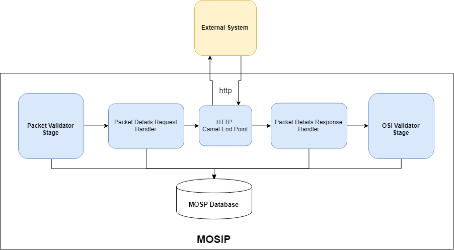

# External System Integration Stage 

**Background**
Technical stack used in Registration Processor gives ability to add or change order/sequence of stages/route in the flow. Most of the stages works in isolation, can be deployed independently and does not depend on the previous or next stage in the flow. This design document will helps support team to understand steps to integrate with external system using vertx.

**The target users are -**
Product technical support team.

**The key requirements are -**
-	MOSIP product should have capability to integrate with external system.

**Apache Camel Bridge Limitation-**
All the vertx stages in registration process are configured using apache camel brige to execute in a sequence. Though technically it is possible to add or remove stages in the camel bridge but in some cases this sequece or order can not be altered due to highly dependent activity. For example Packet Receiver, Virous Scanner and Packet Uploader need to work in sequence. 

**The key non-functional requirements are**
1.	Introduce vertx stage which can be pluged in between stages in registration processor.
2.  Auditing of the all the transactions including success and failed scenario.
3.	Logging of the all the requests
- 	INFO log message in case print request success or failed
- 	DEBUG log message in case if data fetched, PDF and text documents are created, PDF send on the queue.
- 	ERROR log message in case of any exception and retry
4.	Exception handling


**Solution**

------------

**Add Stage: **

- Additional stage can be created which is then deployed in line with existing Event Bus.
This additional stage is responsible to communicate with the external HTTP end points.

**The key solution considerations are -**
1.	Create Vertx Stage:
- Create vertx stage (ExternalIntegrationStage) by extending MosipVerticleManager abstract class and provide implementation for abstract method. 
- Add bussiness logic in process method which includes connecting to HTTP endpoint, send request and process response
- Once business logic executed successfully, update packet process status (SUCCESS) in registration table as in case of failure reprocesser will process it.
- In case of exception update status with ERROR

2.	Apache Camel Changes:
- 	Update apache camel DSL xml file:
Add additional route in DSL xml file for created vertx. 

Example: For example let's integrate created stage : ExternalIntegrationStage between existing packet validator and OSI validator stage. To include this stage apache camel DSL file - "registration-processor-camel-routes.xml" need to be update in spring configuration.
	
Below is the route details from original registration-processor-camel-routes.xml file:

```html
	<!-- Packet Validator to OSI Validator Route -->
	<route id="packet-validator-->osi-validator route">
		<from uri="vertx:packet-validator-bus-out" />
		<log
			message="packet-validator-->osi-validator route ${bodyAs(String)}" />
		<choice>
			<when>
				<simple>${bodyAs(String)} contains '"isValid":true'</simple>
				<to uri="vertx:osi-validator-bus-in" />
			</when>
			<when>
				<simple>${bodyAs(String)} contains '"isValid":false'</simple>
				<to uri="vertx:message-sender-bus" />
			</when>
			<when>
				<simple>${bodyAs(String)} contains '"internalError":true'</simple>
				<to uri="vertx:retry" />
			</when>
			<otherwise>
				<to uri="vertx:error" />
			</otherwise>
		</choice>
	</route>
```
Update above apache camel route with the below:

```html

	<!-- Packet Validator to External Integration Route -->
	<route id="packet-validator-->external-integration route">
		<from uri="vertx:packet-validator-bus-out" />
		<log
			message="packet-validator-->external-integration route ${bodyAs(String)}" />
		<choice>
			<when>
				<simple>${bodyAs(String)} contains '"isValid":true'</simple>
				<to uri="vertx:external-integration-bus-in" />
			</when>
			<when>
				<simple>${bodyAs(String)} contains '"isValid":false'</simple>
				<to uri="vertx:message-sender-bus" />
			</when>
			<when>
				<simple>${bodyAs(String)} contains '"internalError":true'</simple>
				<to uri="vertx:retry" />
			</when>
			<otherwise>
				<to uri="vertx:error" />
			</otherwise>
		</choice>
	</route>
		<!-- External Integration to OSI Validator Route -->
	<route id="external-integration-->osi-validator route">
		<from uri="vertx:external-integration-bus-out" />
		<log
			message="external-integration-->osi-validator route ${bodyAs(String)}" />
		<choice>
			<when>
				<simple>${bodyAs(String)} contains '"isValid":true'</simple>
				<to uri="vertx:osi-validator-bus-in" />
			</when>
			<when>
				<simple>${bodyAs(String)} contains '"isValid":false'</simple>
				<to uri="vertx:message-sender-bus" />
			</when>
			<when>
				<simple>${bodyAs(String)} contains '"internalError":true'</simple>
				<to uri="vertx:retry" />
			</when>
			<otherwise>
				<to uri="vertx:error" />
			</otherwise>
		</choice>
	</route>

```

**Logical Architecture Diagram**


------------
- Without http end point:


- With http end point:




**Class Diagram**

------------


**Sequence Diagram**

------------


