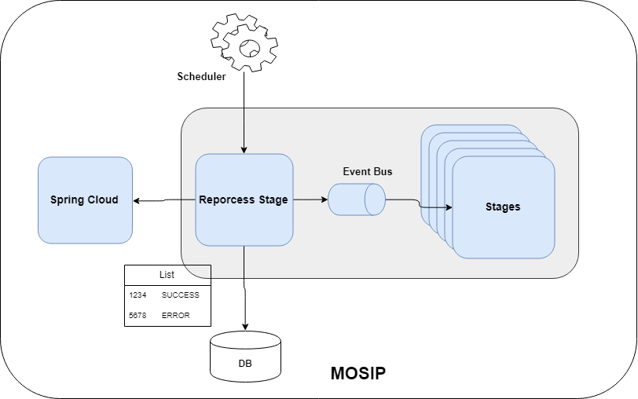

# Approach for Reprocess Design 

**Background**

Registration process is assembled using number of stages, which communicate with each other by event bus. Each stage is isolated from each other and does not know about the sequence of stages in registration process. Each stage will be independently managed and deployed and will run in sequence, which will be manage by camel bridge. In case of failure, crash, system, or stages goes down packet might not process successfully. Once system or stages are up and run successfully, then system should process packets, which are not submitted successfully.

**The target users are -**

- Application support team
- System Administrator Team

**The key requirements are -**
-	In case of system crash or non-availability of any external system or any end point in registration processor, all stages should have capability to re process packets in case if any packet not processed successfully whenever system is back up and running.

**Below is the behavior of the system in case of issue:**
- In case if, there is temporary issue like time out exception or REST endpoint or data base connection timed out then system should try to resend packet. Systems maximum resend attempt are configure in configuration server.  
- In case if system crash while processing requests, system should be in a position to reprocess them one it is up and running
- In case packets is not be processed which might be due to bottleneck or due to any technical reason, system should have capability to reprocess them once issue is resolved.

**The key non-functional requirements are**
1.	Auditing of the all the transactions including success and failed scenario.
2.	Logging of the all the requests
- 	INFO log message in case print request success or failed
- 	DEBUG log message in case if data fetched, PDF and text documents are created, PDF send on the queue.
- 	ERROR log message in case of any exception and retry
3.	Exception handling
4.	Performance: Should have capability to re-process messages at off peak time which will be configurable.

**Solution**

The key solution considerations are -
1.	Alter REGISTRATION table by adding below column:
- 	"latest_regtrn_id"
- 	"latest_trn_status_code"
- 	"latest_regtrn_dtimes"
- 	"latest_stage_name"
-	"process_retry_count"

2.	configuration Configuration changes:
- 	Add key registration.processor.reprocess.attempt.count with value 3
- 	Add key registration.processor.reprocess.schedule.trigger.time with value in second is: 86400 (24 hours)
-   Add key registration.processor.reprocess.fetchsize with value 1000
-   Add key registration.processor.reprocess.elapse.time with value in second is: 21600

3.	Fallow below steps while processing packet in all stages which gives system capability to re-process records in case of crash:
4.	Transaction management need to be implemented properly to manage multiple data base operations in stages to ensure data integrity and consistency.

5.	Update REGISTRATION table with the values as suggested below:
    + Update column "latest_trn_type_code" with the value stage name
    + Update "latest_trn_status_code" column with below values while processing packet:
      +  SUCCESS: In case processing successful
      +  FAILED: In case if validation fails
      +  ERROR: In case of exception while processing packet
      +  REPROCESS: Update status with this value in case of exception which can be re-processed latter. Some of exceptions are like database or REST end point connection time out
      +  PROCESSED: This status indicate that end to end processing of packet is successful

4. Reprocess Stage 
+	Create a Vertx state: Reprocess Stage
+	Use Vertx Chime scheduler to execute job at specific time interval. Time interval value can be fetched from configuration server using key: registration.processor.reprocess.schedule.trigger.time 
+	Once scheduler triggered, add logic in the job to fetch records from registration table, filtered on status is SUCCESS or ERROR and reprocess_count less than the value configured in configuration server using key: registration.processor.reprocess.attempt.count. Also filter data by number of records using value configured in configuration server using key: registration.processor.reprocess.fetchsize and last update time "upd_dtimes" less than current time minus time configured in configuration server using key : "registration.processor.reprocess.elapse.time"
+   Once data fetched iterate through each records and update column "latest_regtrn_dtimes" in REGISTRATION table for each recoard with the current system time. 
+	For each record to be feachted construct data transfer object or camel payload object to be send to vertx stages.   
+	Send event on the Vertx event bus with the created payload to process record further in registration processor flow.
+	Once event send successfully increment "process_retry_coun" value in database by one and update it in database.
+	Repeat above steps in case if data is more than fetch size configured in config server using key: registration.processor.reprocess.fetchsize
+	In case reprocess_count reach to the maximum value configured in configuration server (using in key:registration.processor.reprocess.attempt.count ) then send notification mail.
+	Update registration status service to include above mentioned columns

**Logical Architecture Diagram**

------------

**Sequence Diagram**

------------

