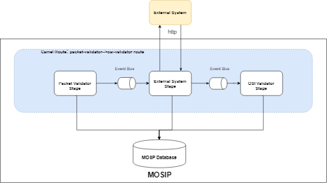

# External Stage Integration

**Introduction**

Technical stack used in Registration Processor gives ability to add or change order/sequence of stages/route in the flow. Most of the stages works in isolation, can be deployed independently and does not depend on the previous or next stage in the flow. This design document will helps support team to understand steps to integrate MOSIP with external system using http end point.

This document is intended for advanced option to integrate external system with the MOSIP.

**Prerequisites**
- System integrator need some understanding about vert.x, apache camel and camel bridge
- Also system integrator need good understanding about java, spring and JPA
- MOSIP setup and deployment is done successfully

**Set Up Development Environment**
Use below tools and libraries for the development. Versions used for various libraries can be found from [here](https://github.com/mosip/mosip/wiki/Technology-Stack "here")
1. Eclipse or Intellij IDE
2. MOSIP Code
3. Maven installed on machine
4. Java installed on machine

**External System Integration Options**
Below are the option system integrator team has to integrate external system with MOSIP:

1. *Using Apache Camel HTTP end points*
2. *Using Vert.x Stage*

**1. Using Apache Camel HTTP end points**
1. Create REST API service which will be consumed by apache camel
1. Download and open MOSIP project source code in eclipse
1. Add handler "PacketDetailsRequestHandler.java" in "registration-processor-common-camel-bridge" to fetch data and construct request to be send to REST service
1. Also add handler "PacketDetailResponseHandler.java" in "registration-processor-common-camel-bridge" to read REST API response and construct payload which will be passed to stage
1. Open "registration-processor-camel-routes.xml" from "config" project from MOSIP source code and update it by adding handlers and REST end point as shown below:
```xml
<route id="packet-validator-->osi-validator route">
		<from uri="vertx:packet-validator-bus-out" />
		<log
			message="packet-validator-->osi-validator route ${bodyAs(String)}" />
		<choice>
			<when>
				<simple>${bodyAs(String)} contains '"isValid":true'</simple>
				<to uri="bean:packetDetailsRequestHandler"/>
				<setHeader headerName="CamelHttpMethod">
			      <constant>GET</constant>
			    </setHeader>
				<to uri="http://domain.name/registration/packetdetails" />
				<to uri="bean:packetDetailResponseHandler"/>
				<to uri="vertx:osi-validator-bus-in" />
			</when>
			<when>
				<simple>${bodyAs(String)} contains '"isValid":false'</simple>
				<to uri="vertx:message-sender-bus" />
			</when>
			<when>
				<simple>${bodyAs(String)} contains '"internalError":true'</simple>
				<to uri="vertx:retry" />
			</when>
			<otherwise>
				<to uri="vertx:error" />
			</otherwise>
		</choice>
	</route>
```
6. Commit changes and deploy project
1. Sample code and example can be found from [location](https://github.com/mosip/mosip/tree/0.12.0/registration-processor/proof-of-concepts/external-stage-int/registration-processor-camel-bridge "location"). Please refer to the "registration-processor-camel-bridge" project from example.

**Logical View of External Integration using Apache Camel HTTP end points**

------------


**2. Using Vert.x Stage**
1. Create REST API service which will be consumed by vert.x stage
1. Download and open MOSIP project source code in eclipse
1. Create maven project under "core-processor"
1. Add java class by extending MosipVerticleAPIManager and provide implementation for abstract method as shown in example
1. Add logic to fetch packet information and connect to HTTP external system by passing packet data and also to read response from HTTP end point. Once received response successfully construct MessageDTO to send event.
1. Update "registration-processor-camel-routes-secure-{dev}.xml" to send event from OSI validator stage (stage which send event to external stage for example) to external integration stage as shown below:
```xml
<route id="osi-validator-->external-stage route">
		<from uri="vertx:o-s-i-validator-bus-out" />
		<log
			message="osi-validator-->external-stage route ${bodyAs(String)}" />
		<choice>
			<when>
				<simple>${bodyAs(String)} contains '"isValid":true'</simple>
				<to uri="vertx:external-bus-in" />
			</when>
			<when>
				<simple>${bodyAs(String)} contains '"isValid":false'</simple>
				<to uri="vertx:message-sender-bus-in" />
			</when>
			<when>
				<simple>${bodyAs(String)} contains '"internalError":true'</simple>
				<to uri="vertx:retry-bus-in" />
			</when>
			<otherwise>
				<to uri="vertx:error-bus-in" />
			</otherwise>
		</choice>
	</route>
```
7. Send event from external stage to next stage by updating "registration-processor-camel-routes.xml" as shown below:
```xml
	<route id="external-stage-->demo-dedupe route">
		<from uri="vertx:external-bus-out" />
		<log
			message="external-stage-->demo-dedupe route ${bodyAs(String)}" />
		<choice>
			<when>
				<simple>${bodyAs(String)} contains '"isValid":true'</simple>
				<to uri="vertx:demo-dedupe-bus-in" />
			</when>
			<when>
				<simple>${bodyAs(String)} contains '"internalError":true'</simple>
				<to uri="vertx:retry-bus-in" />
			</when>
			<otherwise>
				<to uri="vertx:error-bus-in" />
			</otherwise>
		</choice>
	</route>
```

8. Commit and deploy changes.
1.  Sample code and example can be found from [location](https://github.com/mosip/mosip/tree/0.12.0/registration-processor/proof-of-concepts/external-stage-int/stages "location"). Please refer to the "external-system-integration-stage " project.

**Logical View of External Integration using Vert.x Stage**

------------



