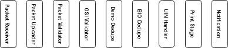
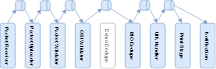
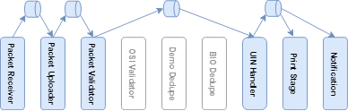

### Orchestration

MOSIP architecture fallows SEDA architecture pattern which encourage to create stages which can be executed and deployed independently.
Registration processor is spilt into multiple fine grained tasks which is executed by stages. In registartion processor orchestration is achived by composing all these stages together to achieve businses objective which is to create unique user identity.

Stages in MOSIP are not designed to communicate directly with each other. 
Orchestration in MOSIP works through exchange of events between the stages

This event based approch gives flexibility to create work flow by putting  these stages together. Multiple workflow can be created based on the business need which is executed independently. Advantage of this is code becomes more readable as developer understand process by looking at these workflows. 

##### MOSIP Stages
------------

##### Lost UIN Flow:
------------

##### Activate Deactivate UIN Flow:
------------
