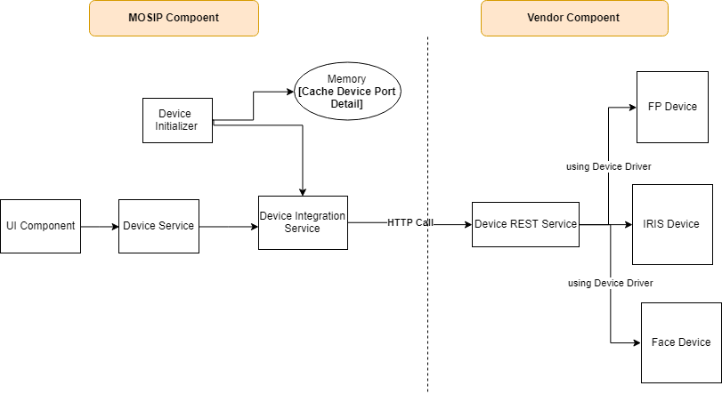

**Design - Bio-Metric Device Manager**

This document covers the technical design of Device Manager [DM], which will be used to Discover and Register  
the Bio-metric devices and forward the subjective information to MOSIP Registration client application.  
The Registration client application further uses the information to communicate with the device and capture the required bio-metric detail.    

There are three major entities are being considered to interact with Bio-metric devices.   
   1. MDM [MOSIP Device Manager - Provided by External third party].  
   2. MDI  [Mosip Bio Device Integrator - Provided by MOSIP].  
   3. Application [Registration client application - Provided by MOSIP].    

**Device Integration Block Diagram:**  
  

The technical detail of the DM and Registration client application is briefly covered in this document. MDM technical spec is out of this document.  

1. Mainly **Http protocol** will be used to communicate between Registration client Application, MDI and MDM services.  
2. The Standard REST call procedure would be followed to make the connection and the request and resposne would follow the standard JSON spec.     
3. MDM Service internally uses required driver to communicate with the Bio-metric devices.    
4. Application opens the Http communication with the defined port from MDI.    
5. All requests and responses carry a requestId, which is a numeric value (128 bit), represented as a 36 character UUID format.  

**Out of Scope:** 
   - The MDM technical design is out of scope of this document.  
     

**MDI - Mosip Device Integration:** 
This component should open the connection with the configured port [from property file] and listen for messages from MDM service. 

The MOSIP provided MDI service, is responsible for the following:  
   - Identify the MDM service running port by scanning across the configured ports and store the same in cache. 
   - Maintain the list of the all the supported biometric devices available for the
     applications.  
   - It Notify the applications about arrival and removal of the supported devices .  
   - Once the request has been triggered to the MDM, the client would wait for certain period to receive the response, if there is no response then terminate the request.
   - Separate http call would be triggered for each and every requests.   

  
**MDI Consuming messages:** 
   1. Connect  
   2. Ping  
   3. Device Discovery   
   4. Device Info  

**Application :**  
 The Application must connect to the MDI to discover the biometric devices.  
Once discovered, the application must connect to the required devices through the respective 'BioDevice' object. 

   - Once the application started then invoke the init() method in MDI component, to identify the list of configured ports for MDM services.  
   - Try to connect with the port to identify the running MDM.
   - If MDM is running in the specified port then it parses the requests and provide response based on the request type.
   - The JSON structure is followed to send and receive the data from MDM.  
   - Once the response received from MDM then parse the response and send the required information to the invoking application controller. 
   - Binary stream would be used to receive the video stream of BIO data and render the same to UI application. 	
  

**On click of capture button in application UI:**  

**Device Integration - Class and Sequence Diagram:**  
  

**Device Available:**
	A timer would be configured in the application to regularly call the DM to check for the availability of devices.  
	Below provided XML message would be prepared and send to the DM to confirm the device status.  
	Based on this the flag in the UI would be updated.  
	This request would regularly update the local cache about the device status, which would be used during capture process.  
	
  