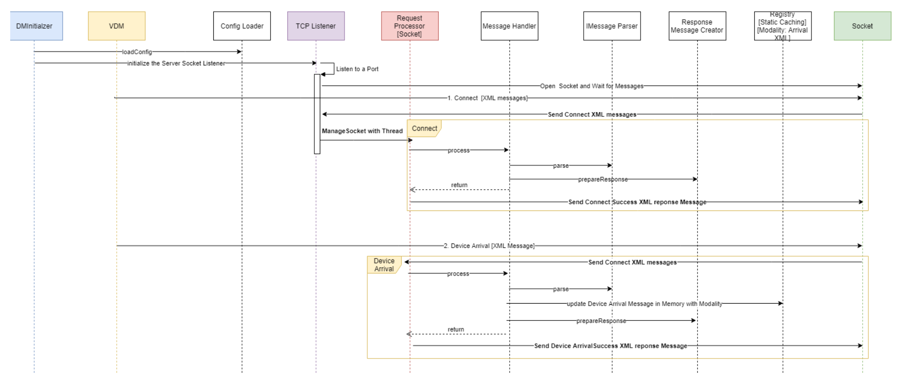
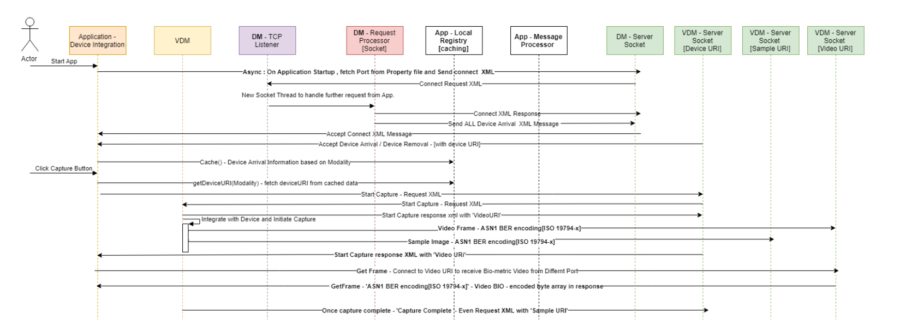

This document covers the technical design of Device Manager [DM], which will be used to Discover and Register the Bio-metric devices  
and forward the subjective information to MOSIP Registration client application. The Registraction client application further uses the information to 
communicate with the device and capture the required bio-metric detail.    

  

There are three major entities are being considered to interact with Bio-metric devices. 
   1. VDM [Vendor Device Manager - Provided by MOSIP].  
   2. DM  [Device Manager - Provided by MOSIP].  
   3. MOSIP - Registration client application.  

The technical detail of the DM and Registration client application is briefly covered in this document. VDM technical spec is out of this document.  

1. Mainly **TCP protocol** will be used to communicate between DM to VDM and Registration client Application to VDM services.  
2. DM and VDM acts as port listener by using 'ServerSocket' component from net package to register and capture information from Bio-metric devices.  
3. VDM internally uses required driver to communicate with the Bio-metric devices. The VDM technical design is out of scope of this document.   
4. Application opens the Socket communication with the defined port of DM and upon confirmation from DM, it makes the communication with VDM through Port.    
5. All requests and responses carry a requestId, which is a numeric value (128 bit), represented as a 36 character UUID format string in XML.  
6. 

  

DM : 
The Device Manager should open the connection with the configured port and listen for messages from clients [VDM and Application]  

The DM service provided by the UID, is responsible for the following:  
   - Listen on the device arrival and removal events from the vendor-specific device 
     manager (VDM).  
   - Maintain the list of the all the supported biometric devices available for the
     applications.  
   - Notify the applications about arrival and removal of the supported devices (
     PNP).  
   - The requestId is used to connect requests with the appropriate response.   
   - DM Listener create a separate Socket thread for each VDM and application.  
   - The VDM uses the same Socket for all the underlying devices communication. 
   - The application uses the same Socket for all the communication with DM. 

  

   
**Supported functions in DM:** 
   1. Connect  
   2. Ping  
   3. Device Arrival  
   4. Device Removal  

**Connect:**  
Once the application and VDM started then uses this method to connect with DM and establishes the connection.  
The same socket connection is used further to communicate with the DM by application and VDM.   

Once the connection has been created then send the below provided XML from either VDM or Application :

<DeviceManagerEventRequest requestId="" version="">
	<Connect apiVersion="">
		<VDM vendor="" vdmName="" vdmVersion=""/> <!-- Provided by VDM -->
		<APP vendor="" appName="" appVersion=""/> <!-- Provided by Application -->
	</Connect>
</DeviceManagerEventRequest>

<DeviceManagerEventResponse requestId="">
	<Return value=""/>
	<ConnectResponse apiVersion="" vendor="" dmName=""
	dmVersion="" heartBeat=""/>
</DeviceManagerEventResponse>

**Ping :**  
This is used as a heartbeat event, to notify the DM that a VDM, is still alive.  

<DeviceManagerEventRequest requestId="">
	<Ping vdmName=""/>
</DeviceManagerEventRequest>
<DeviceManagerEventResponse requestId="">
	<Return value="" failureReason=""/>
</DeviceManagerEventResponse>

**Device Arrival:**  
The event notifies the device manager, and the application about a device arrival. The  
VDM originates this event, and sends it to the DM, which in turn forwards it to the  
Application on the Socket already created by client application.   

On arrival of each devices this message is triggered to the DM.  

<DeviceManagerEventRequest requestId=""> 
	<Arrival vdmName="" deviceURI="" modality="Fingerprint Slap" 
		deviceMake="Manufacturer Name " deviceModel="DEVICE MODEL NAME />  
		IDENTIFIER " hardwareRev="1.0.0" firmwareRev="1.0.1"
		serialNumber="ABC1234567">
		<Capabilities detection="True" video="True"
			autoCapture="True" disableAutoCapture="True" userFeedback="True"
			graphicalFeedback="False">
			<VideoFormats>
				<VideoFormat videoFormatId="1" modality="Fingerprint
					Slap ">
					<FrameType biometricPosition="Any" size="800,750"
						pixelFormat="Gray8" pixelResolution="250ppi" />
				</VideoFormat>
			</VideoFormats>
			<SampleFormats>
				<SampleFormat formatId="1" format="ISO IEC 1 views="1"
					size="1600,1500" pixelResolution="500ppi" />
			</SampleFormats>
		</Capabilities>
	</Arrival>
</DeviceManagerEventRequest>

<DeviceManagerEventResponse requestId="">  
	<Return value="1" failureReason="0" />  
</DeviceManagerEventResponse>  

**Device Removal :** 
<DeviceManagerEventRequest requestId="">  
	<Removal deviceURI="" />  
</DeviceManagerEventRequest>  

<DeviceManagerEventResponse requestId="">  
	<Return value="" failureReason="0"/> 
</DeviceManagerEventResponse> 

Registry Manager - It is a static instance, where we can cache the application level data.  
	1. Data from property file.
	2. Device Arrival/ Removal information along with VDM detail.
	3. Registered Application information. 
	
Registry - It holds the data of every 

**Application : **  
 The Application must connect to the DM to discover the biometric devices. 
Once discovered, the application must connect to the required devices. These connections  
are maintained for the **life of the application**, and the application must expect to receive  
notifications and events about the device arrivals and removals during this time.  

   - Once the application started then load the DM running ports from property file.  
   - Span a separate thread to check the connectivity with the DM defined ports.  
   - If connected then send the 'Connect' message to DM.   
   - Once send the success response to application then DM will send the available device detail to application.  
   - Application can use the 'Device A 

**On click of capture button in application UI:**  

  

**Connect:**  
	On establishing connection with the DM, the application must ensure that  
they are connecting with a DM, and exchange certain configuration information.  

DeviceArrival:  This message would be forwarded to the application through the already open socket, to communicate  
	about the Device level information. The application uses the 'deviceURI' to communicate with VDM.  

**Device Available:**
	A timer would be configured in the application to regularly call the DM to check for the availability of devices.  
	Below provided XML message would be prepared and send to the DM to confirm the device status.  
	Based on this the flag in the UI would be updated.  
	This request would regularly update the local cache about the device status, which would be used during capture process.  
	
<DeviceManagerEventRequest requestId="">  
	<Available deviceModality="" />  
</DeviceManagerEventRequest>  

<DeviceManagerEventResponse requestId="">  
	<Available value="" failureReason="0"/> 
</DeviceManagerEventResponse> 

**Subscribe:**

Application uses 'DeviceCommandRequest' object to send the event to the VDM. 

**Start Capture:** 

   On success response from VDM, the application can use the either one of the below provided URI to communicate with VDM and  
   capture the Sample or Video stream.
   
   videoURI : will be provided in the response of this message.

Capture Complete - 
   This is called by VDM once the capture completed and uses the existing socket to send the response to the application along with sampleURI. 
   For multiple samples, it provides different sampleURI to the application.  
   This will be kept opened until the response received from application. 
   Application uses the 'sampleURI' to read the capture the data and then send the 'Capture Complete' response to VDM.  
   'DeviceEventRequest' 

   sampleURI : will be provided in the response of this message.

Detection - 
   This is called by VDM to inform the application about the change of the state of the biometric whether it is placed or removed. 
   Based on which, the application should react. 

User Feedback - 
   This is called by VDM to provide the feedback message to the application UI about the biometric placed over the device.     
   
   <Sequence required ..> 
  
List of Events:
   Detection, UserFeedback  
   
  
**VDM :**

  This service only supports the capturing of Bio-metric images from the devices. It doesn't provide the features to segment or match the bio-metric data.  
  	
   deviceURI :The device should reject the connections on the deviceURI, until the existing socket is closed.  
   sampleURI : will be provided in the Complete Capture event request message.  
   videoURI : will be provided in the response of Start Capture message.    
  
  
  