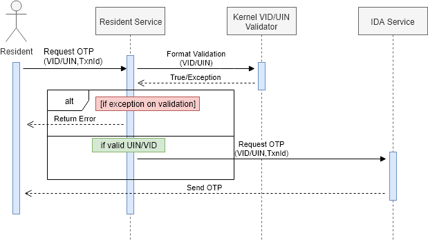
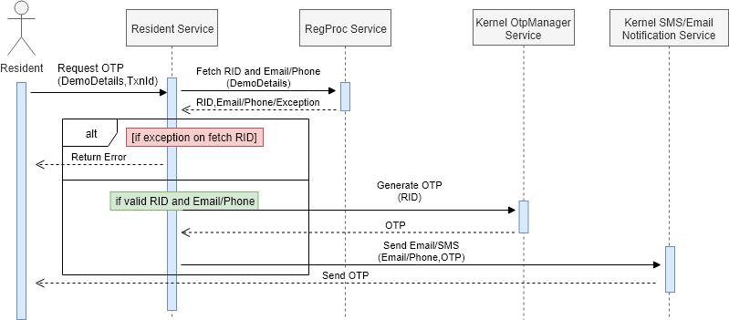
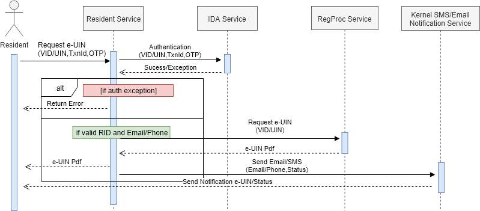

# Resident Service

## 1. Background       

Resident services can be used by resident to check service request status, get e-UIN, Update UIN, Request for RePrint UIN, get lost RID/UIN, genearte/revoke VID, lock/unlock specific auth type and get Auth history etc. 

***1.1.Target Users -***  
-  Resident who has registered for UIN.    
  

***1.2. Key Functional Requirements -***   
-	Receive request for OTP generation
-	Receive request for resident related services
-	Send notification on registered Email/Phone

***1.3. Key Non-Functional Requirements -***   

-	Logging :
	-	Log all the exceptions along with error code and short error message
	-	As a security measure, Individual's UIN should not be logged
-	Audit :
	-	Audit all transaction details in database
	-	Individual's UIN should not be audited     

### 2.	Solution    

The key solution considerations are   
- Create a project which provides REST service to resident UI portal.     
- REST service can be used by any MOSIP module to access these services through HTTP client   

#### 2.1. Request for OTP

This service enables Individual to request for an OTP. The OTP will be send via registered message/email to the Individual. This OTP can then be used to authenticate in other resident services.

**OTP request with VID/UIN**

   

**OTP request with Demo Details**

 

#### 2.2. Service Request Status Check 

This service will respond with service request (UIN Generation/Updataion,Reprint etc) status to registerd phone/email.

 

#### 2.3. Get e-UIN 

This request will authenticate an Individual based on provided OTP and UIN PDF will be sent to registered Email.

 

#### 2.4. Request for re-print UIN

This request will authenticate an Individual based on provided OTP and post a request for UIN re-print to Postal Service.

** Sequence Diagram TBA **

#### 2.5. Get lost UIN

This request will authenticate an Individual based on provided OTP and UIN PDF will be sent to registered Email.

** Sequence Diagram TBA **

#### 2.6. Get lost RID

This request will authenticate an Individual based on provided OTP and RID will be sent to registered Phone/Email.

** Sequence Diagram TBA **

#### 2.7. Update UIN

This request will authenticate an Individual based on provided OTP and RID will be sent to registered Phone/Email after successfully placing update request to Registration Processor.

** Sequence Diagram TBA **

#### 2.8. Generate VID
This request will authenticate an Individual based on provided OTP and will generate VID for the respective UIN.

** Sequence Diagram TBA **

#### 2.9. Revoke VID
This request will authenticate an Individual based on provided OTP and will revoke respective VID.
      
** Sequence Diagram TBA **
      
#### 2.10. Auth Lock
This request will authenticate an Individual based on provided OTP and will lock provided authentication types.

** Sequence Diagram TBA **
   
#### 2.11. Auth Lock
This request will authenticate an Individual based on provided OTP and will unlock provided locked authentication types.

** Sequence Diagram TBA **

#### 2.11. Get Auth History
This request will authenticate an Individual based on provided OTP and auth history will be sent to registred Phone/Email.

** Sequence Diagram TBA **
   

**2.1.	Class Diagram**   
** Class Diagram TBA **

#### 3. REST API Specs

[Refer Wiki for Resident Services APIs](https://github.com/mosip/mosip/wiki/Resident-Service-APIs) 