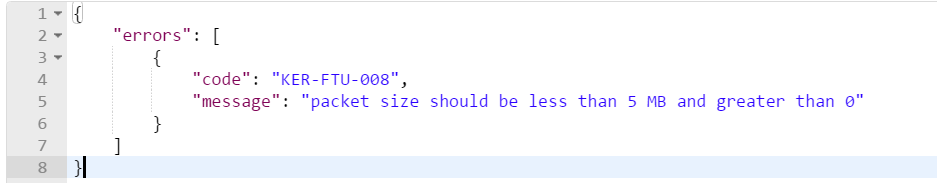
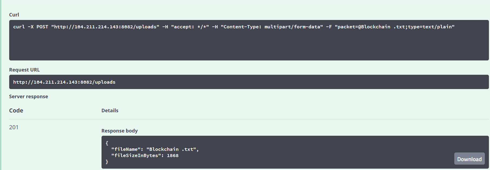

## kernel-packetserver-http
This folder has kernel-packetserver-http module which can be used to upload packet.

 
### [Background & Design](../../design/kernel/kernel-packetserver-http.md)
 

### Api Documentation
[API Documentation <TBA>](TBA)

```
mvn javadoc:javadoc
```
### Properties to be added in parent Spring Application environment 
[kernel-packetserver-http-dev.properties](../../config/kernel-packetserver-http-dev.properties)

##### If there is any error which occurs while upload, it will be thrown as Exception.


### Usage Sample
  Usage 1:
  



