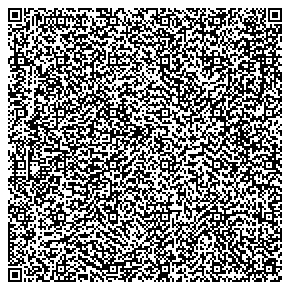

## kernel-qrcodegenerator-zxing

[Background & Design](../../docs/design/kernel/kernel-qrcodegenerator.md)


[API Documentation]

```
mvn javadoc:javadoc
```

**Maven dependency**
  
 ```
    <dependency>
		<groupId>io.mosip.kernel</groupId>
		<artifactId>kernel-qrcodegenerator-zxing</artifactId>
		<version>${project.version}</version>
	</dependency>
 ```

**The inputs which have to be provided are:**
1. Data to be encoded in QR-code in string.
2. QR code version.


**The response will be *byte array* of QR Code PNG image** 

**If there is any error which occurs while generating QR code, it will be thrown as Exception.** 

**Exceptions to be handled while using this functionality:**
1. QrcodeGenerationException
2. NullPointerException
3. InvalidInputException
4. IOException

**Usage Sample**
  
*Usage:*
 
 ```
@Autowired
QrCodeGenerator<QrVersion> generator;
	
    String name = "N : UserName";
	
	String dob = "D : 17-05-1996";
	
	String address = "A :  Mindtree LTD  "Global village Tech Park Rd, RV Vidyaniketan,RR Nagar,Bengaluru, Karnataka 560098";
	
	String uin = "uin : 927391028372";
	
	String gender = "G : Male";
	
	byte[] fileBytes=FileUtils.readFileToByteArray(new File("ImageFilePath"));
	
	byte [] QrCodeInBytes=generator.generateQrCode(name+"\n"+dob+"\n"+address+"\n"+uin+"\n"+gender+"\n"+"I:"+CryptoUtil.encodeBase64(fileBytes), QrVersion.V30);
	
	String filePath = "File.png";
	
	FileUtils.writeByteArrayToFile(new File(filePath), QrCodeInBytes);
	
```
 
 *Output*
 
```
�PNGIHDR����g�IDATx��Y͊�����*�Ӏ��4�N����==���ަ��]kw}F]?):��k�� q�y���&�.�:V�� ,���l�� 3{.���G�@T%�Qd_��i�>g,oS���i-�Z��P��~��4�)�H�J�u�`�Z�X��3T*��Q)�yN��|=�YyxpF�#&-��왲��<| :o�݂��Ԧ�"�c�`����EXʙ��Z}��</ ��l�>���~bX��#O��>1v�Q��jh�Y��]O��m���=wL�X��$�&a/��!��U'���$��T���2T{��G��.�K�%��O �����C����cw<q����4��b�6y�C�^�ϖ�U����kH5�O Ş�j>w��ٍ��}����y���}c��*%L�e�=� X�ÓY�Z�-�TKH�`�Մv��s��G\�gw}��鎺b�t�f�-v�=��v�ces��ˏH���ГF�p�B�Qv҆G�a/ .�%�^,�GN4�����3:�Ljc6���`�> 8/ ���0�����_m9H菫� �Yk[w��ݓ-s�:/����ٖiL�,l�dI�� �fX#�vht�6�о����Lc�4�p�7D�m<p����-L��ٖ/�M�� x���3$��&��\`�a?��_�F���+�;���;��@��R��	񠂭��#��^ $��� ���k�fI� �h���䱇�^t�U�z� �fa��A���,���k�'�w��������ˬ���'�����ꌅ���5����|� Χ�����=y���'�潈'��V��a�E�� �)I1Ɯ��������	@_��9׉P�����=�o����V^��d�e�>�  \��f��Ұ�h7�=k��L�'��-�F��n�	{ Q �L,�`9ύ�Z!�r2������� E{{`��ھ��1[Ԅ[x`8Ψ�i��S�F�'�Gb� p�Ͼ�u�䴙\(9�쿣�(�`�|�Ns_-Z��ka_ ױ68� �C���ȆI�'@�9r�^�w\s�ar@��.~��s3�m����ۯu�?0�Zp6�DX�'y�?�� l�� �\�	��I���'� ׁ�{���m	h����� ,��w�[FQxn��ay\bO "�����(^[&�����O@@�|"��v����`��!~HPC|����copP���G�y��|m�L��Yw��P���/��L���g��kBh3��^ ���o^�~�DjP$l�_�>|�~:�^�PX|�-��p��1���kAe�(���'�`���֎cq=�4�w_ b=��'�#tb[�����n~PPG�G�(�����SOy2�rbv�e�i�+w� �f�v������T>�b�'��ͲC��]�:�q���' +�-�sܱ���EȦ��' Z32`O���#_n�9����s7zP�0�"��|o��*� �ܭ��&�	�N7VW��O��Ѡ�X�����CE>`��t~�ӾW�!�W%f�p�"A7�SF�������1 ��f��b�K��?�o�=���(o|���]}zl���@�o`@���|ԟ]�(U1���°G�kycw^l�:Lvj���l���2yA;b�l����QͲ$z�M�~�{����}������� ����Y�EH�7��U*�7 �Y�1}6�{�B��0fD�Z0H��oPć��	��Q�#�,�ߨ�j"��?&)�J�����{m���K(_��D����$a�q� 6kN�ʢWy�co�o�?��	-n7S�ΰ�I��� �q�&�9�*��C�P���k� C��W����M�WF׏_ ���ns��b�2� [� ��_P�ݒ����ݳ���`ŹW<�8]�����,���0�Ζ����7�{Hv�~D�	PE*��m����k���Ê���� ����ɷч���*Uoy�{s�3�KMf!?����M��A�&���Bt�!U�>��(��~f�����:CP�l�' �h�d�!"�mZ?� +�%����=V�Y\��	8X߄�ܫ6F�N8���b1����G�T���{�������a8�BLǽ���h�6� �}�$�����$ Sm��G���R���ca0*���uj=rá�X�{��2u_2��#�O ml��<Ptl=��3P��>O b�{xF�I�D��0�>|� ��'����[� IEND�B`�
```

*QR Code Sample*




